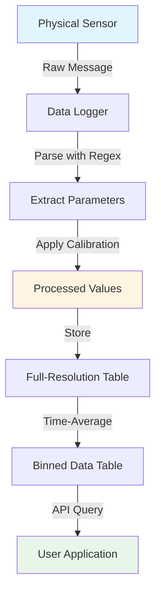

# CORIOLIX Data Model

This guide explains how data is organized in CORIOLIX, helping you understand the relationships between vessels, sensors, parameters, and data observations.

!!! info "For API Users"
    Understanding the data model will help you construct efficient API queries and interpret responses correctly.

## Overview

CORIOLIX organizes oceanographic data in a hierarchical structure:

```
Vessel
├── Cruises
│   ├── Events
│   ├── Stations
│   └── Routes
└── Sensors
    ├── Parameters
    │   └── Data Observations
    ├── Calibrations
    └── Logs
```

## Core Entities

### 1. Vessel

Represents the research vessel and its configuration.

**Key Fields:**

| Field | Type | Description |
|-------|------|-------------|
| `vessel_uuid` | UUID | Unique vessel identifier |
| `vessel_id` | string | Short vessel code (e.g., "TAANI") |
| `long_name` | string | Full vessel name |
| `call_sign` | string | Maritime radio call sign |
| `IMO` | string | International Maritime Organization number |
| `MMSI` | string | Maritime Mobile Service Identity |
| `operating_institute` | string | Institution operating the vessel |

**API Endpoint:** `/api/vessel/`

**Example Response:**
```json
{
  "vessel_uuid": "9b3f9eb0-1166-47a4-95a7-3e795cb9d796",
  "vessel_id": "Point Sur",
  "long_name": "Point Sur",
  "vessel_type": "RV",
  "operating_institute": "LUMCON",
  "operating_country": "USA",
  "home_port": "Gulfport, MS",
  "website": "https://lumcon.edu/rv-pt-sur/",
  "IMO": "8023539",
  "MMSI": "367720010",
  "ICES": "0000",
  "call_sign": "WDI6566",
  "length_meters": 37.8,
  "breadth_meters": 9.75,
  "freeboard_meters": null,
  "draft_meters": null,
  "enabled": false
}
```

### 2. Sensor

Represents a physical instrument that collects data.

**Key Fields:**

| Field | Type | Description |
|-------|------|-------------|
| `sensor_id` | string | Unique sensor identifier |
| `sensor_name` | string | Descriptive name |
| `sensor_class` | enum | Category (Navigation, Atmospheric, Flowthrough, etc.) |
| `sensor_type` | enum | Specific type (Temperature, Salinity, etc.) |
| `vendor` | string | Manufacturer |
| `model` | string | Model name/number |
| `serial_number` | string | Hardware serial number |
| `comm_type` | enum | Communication protocol (RS-232, Ethernet, etc.) |

**Sensor Classes:**

- `Navigation` - GNSS, gyrocompass, heading sensors
- `Atmospheric` - Anemometers, barometers, radiation sensors
- `Flowthrough` - TSG, fluorometers, pCO2 systems
- `OverTheSide` - CTD, winches, profiling instruments
- `Sonar` - ADCP, echosounders, multibeam
- `HullMount` - Hull-mounted thermometers, cameras
- `Other` - Miscellaneous sensors

**API Endpoint:** `/api/sensor/`

**Example Response:**
```json
{
  "sensor_id": "seatem381110",
  "sensor_uuid": null,
  "sensor_name": "Forward Intake Thermometer",
  "sensor_class": "Flowthrough",
  "sensor_type": "Thermometer, Water",
  "sensor_prefix": "thermw",
  "vendor": "Sea-Bird Scientific (Sea-Bird Electronics)",
  "model": "Sea-Bird SBE 38 thermometer",
  "serial_number": "38-1110",
  "comm_type": "RS-232"
}
```

### 3. Parameter

Represents a specific measurement or variable collected by a sensor. A single sensor can measure multiple parameters.

**Key Fields:**

| Field | Type | Description |
|-------|------|-------------|
| `parameter_id` | UUID | Unique parameter identifier |
| `short_name` | string | Abbreviated name (e.g., "SST") |
| `long_name` | string | Full name (e.g., "Sea Surface Temperature") |
| `standard_name` | string | CF convention standard name |
| `units_abbrev` | string | Units (e.g., "degC", "PSU", "m/s") |
| `data_type` | enum | float, integer, string, boolean |
| `global_min` | float | Physical minimum possible value |
| `global_max` | float | Physical maximum possible value |
| `data_table` | string | Database table containing full-resolution data |
| `binned_fieldname` | string | Field name in binned data table |

**API Endpoint:** `/api/parameter/`

**Example Response:**
```json
{
  "parameter_id": "789e4567-e89b-12d3-a456-426614174999",
  "short_name": "SST",
  "long_name": "Sea Surface Temperature",
  "standard_name": "sea_water_temperature",
  "units_abbrev": "degC",
  "data_type": "float",
  "global_min": -2.0,
  "global_max": 40.0,
  "precision": 0.001,
  "data_table": "seapth000000_data",
  "binned_fieldname": "seapth000000_sst"
}
```

### 4. Data Observations

Time-series measurements from sensors. Available in two forms:

#### Full-Resolution Data
Raw observations at the sensor's native sampling rate.

**API Endpoint:** `/api/data/fullres/{sensor_id}/{parameter}/`

#### Binned Data
Time-averaged data at regular intervals (default: 60 seconds).

**API Endpoint:** `/api/data/binned/`

**Example Binned Data:**
```json
{
  "timestamp": "2025-12-04T10:00:00Z",
  "seapth000000_sst": 15.234,
  "seapth000000_sst_count": 60,
  "seapth000000_sst_std": 0.012
}
```

### 5. Cruise

Represents a research expedition with defined start and end dates.

**Key Fields:**

| Field | Type | Description |
|-------|------|-------------|
| `cruise_id` | UUID | Unique cruise identifier |
| `cruise_name` | string | Descriptive name |
| `start_date` | datetime | Cruise start |
| `end_date` | datetime | Cruise end |
| `chief_scientist` | string | Principal investigator |
| `vessel_uuid` | UUID | Associated vessel |

**API Endpoint:** `/api/cruise/`

### 6. Event

Represents a scientific activity or occurrence during a cruise (e.g., CTD cast, sampling event, equipment failure).

**Key Fields:**

| Field | Type | Description |
|-------|------|-------------|
| `eventlog_id` | UUID | Unique event identifier |
| `event_type` | enum | Category of event |
| `event_time` | datetime | When event occurred |
| `latitude` | float | Location latitude |
| `longitude` | float | Location longitude |
| `description` | string | Event details |

**API Endpoint:** `/api/events/`

## Entity Relationships

### Vessel → Sensors (One-to-Many)

A vessel has multiple sensors installed. Each sensor belongs to one vessel.

```python
# Get all sensors on a specific vessel
response = requests.get(
    f"{BASE_URL}/sensor/",
    auth=auth,
    params={"vessel_id": "TAANI", "format": "json"}
)
sensors = response.json()
```

### Sensor → Parameters (One-to-Many)

A sensor measures multiple parameters. Each parameter belongs to one sensor.

```python
# Get chart metadata shows sensor → parameter relationship
response = requests.get(
    f"{BASE_URL}/chart_metadata/{sensor_id}/",
    auth=auth,
    params={"format": "json"}
)
metadata = response.json()

print(f"Sensor: {metadata['sensor_name']}")
for param in metadata['parameters']:
    print(f"  - {param['long_name']} ({param['units_abbrev']})")
```

**Example Output:**
```
Sensor: SBE 38 Digital Oceanographic Thermometer
  - Sea Surface Temperature (degC)
```

### Parameter → Data (One-to-Many)

Each parameter has many time-series observations.

```python
# Get recent data for a specific parameter
response = requests.get(
    f"{BASE_URL}/data/binned/",
    auth=auth,
    params={
        "sensors": "SEAPTH000000",
        "parameters": "SST",
        "date_after": "2025-12-03T00:00:00Z",
        "format": "json"
    }
)
data = response.json()
```

### Cruise → Events (One-to-Many)

A cruise contains multiple events. Each event belongs to one cruise.

```python
# Get all events for a specific cruise
response = requests.get(
    f"{BASE_URL}/events/",
    auth=auth,
    params={
        "cruise_id": "TAANI-2025-001",
        "format": "json"
    }
)
events = response.json()
```

## Data Flow Example

Here's how data flows through the system when a sensor makes a measurement:



## Practical Example: Complete Data Retrieval

This example shows how to navigate the data model to retrieve temperature data:

```python
import requests
from requests.auth import HTTPBasicAuth

BASE_URL = "https://your-vessel.coriolix.org/api"
auth = HTTPBasicAuth("username", "password")

# Step 1: Find temperature sensors
sensors = requests.get(
    f"{BASE_URL}/sensor/",
    auth=auth,
    params={"sensor_type": "Temperature", "format": "json"}
).json()

print(f"Found {len(sensors)} temperature sensors")

# Step 2: Get parameters for first sensor
sensor_id = sensors[0]['sensor_id']
metadata = requests.get(
    f"{BASE_URL}/chart_metadata/{sensor_id}/",
    auth=auth,
    params={"format": "json"}
).json()

print(f"\nSensor: {metadata['sensor_name']}")
print("Parameters:")
for param in metadata['parameters']:
    print(f"  - {param['short_name']}: {param['long_name']}")

# Step 3: Get recent data
data = requests.get(
    f"{BASE_URL}/data/binned/",
    auth=auth,
    params={
        "sensors": sensor_id,
        "date_after": "2025-12-03T00:00:00Z",
        "format": "csv"
    }
)

# Save to file
with open(f"{sensor_id}_data.csv", "w") as f:
    f.write(data.text)

print(f"\nData saved to {sensor_id}_data.csv")
```

## Data Tables Structure

### Full-Resolution Tables

Each sensor typically has its own table for full-resolution data:

| Column | Description |
|--------|-------------|
| `timestamp` | Observation time (UTC) |
| `[parameter_name]` | Measured value |
| `latitude` | Position (if available) |
| `longitude` | Position (if available) |

### Binned Data Table

Aggregated data from multiple sensors:

| Column Pattern | Description |
|----------------|-------------|
| `timestamp` | Bin center time |
| `{sensor}_{parameter}` | Mean value in bin |
| `{sensor}_{parameter}_min` | Minimum value in bin |
| `{sensor}_{parameter}_max` | Maximum value in bin |
| `{sensor}_{parameter}_std` | Standard deviation |
| `{sensor}_{parameter}_count` | Number of observations |

## Query Optimization Tips

### 1. Use Specific Sensor/Parameter Selection

```python
# Good: Request specific data
params = {
    "sensors": "SEAPTH000000,TSG001",
    "parameters": "Temperature,Salinity"
}

# Avoid: Request all data and filter locally
params = {}  # Gets everything!
```

### 2. Leverage Binned Data for Overview

```python
# For plots and overviews, use binned data
response = requests.get(f"{BASE_URL}/data/binned/", auth=auth, params=params)

# For detailed analysis, use full-resolution
response = requests.get(
    f"{BASE_URL}/data/fullres/{sensor_id}/{parameter}/",
    auth=auth,
    params=params
)
```

### 3. Use Time Filters

```python
# Request only needed time range
params = {
    "date_after": "2025-12-01T00:00:00Z",
    "date_before": "2025-12-04T00:00:00Z"
}
```

## Understanding Metadata

### Chart Metadata

Provides quick access to sensor-parameter relationships for visualization:

```python
# Get all available sensors and their parameters for plotting
all_metadata = requests.get(
    f"{BASE_URL}/chart_metadata/",
    auth=auth,
    params={"format": "json"}
).json()

# Organize by sensor class
from collections import defaultdict
by_class = defaultdict(list)

for sensor in all_metadata:
    by_class[sensor['sensor_class']].append(sensor['sensor_name'])

for sensor_class, sensors in by_class.items():
    print(f"\n{sensor_class}:")
    for sensor in sensors:
        print(f"  - {sensor}")
```

## Common Data Patterns

### Time-Series Analysis

```python
import pandas as pd
from io import StringIO

# Get CSV data and load into pandas
response = requests.get(
    f"{BASE_URL}/data/binned/",
    auth=auth,
    params={
        "sensors": "SEAPTH000000",
        "date_after": "2025-12-01T00:00:00Z",
        "format": "csv"
    }
)

df = pd.read_csv(StringIO(response.text), parse_dates=['timestamp'])
df.set_index('timestamp', inplace=True)

# Now you can use pandas time-series functions
daily_mean = df.resample('D').mean()
print(daily_mean.describe())
```

### Multi-Sensor Comparison

```python
# Get related measurements from multiple sensors
response = requests.get(
    f"{BASE_URL}/data/binned/",
    auth=auth,
    params={
        "classes": "Atmospheric,Flowthrough",
        "date_after": "2025-12-03T00:00:00Z",
        "format": "csv"
    }
)

df = pd.read_csv(StringIO(response.text), parse_dates=['timestamp'])
# Columns will include data from all sensors in those classes
```

## Next Steps

- **[Getting Started](API_getting_started.md)** - Learn API basics
- **[Use Cases](API_use_cases.md)** - See practical examples
- **[Endpoints](API_endpoints.md)** - Complete endpoint reference

## Quick Reference

### Key Endpoints by Entity

| Entity | List All | Get Specific |
|--------|----------|--------------|
| Vessels | `GET /api/vessel/` | `GET /api/vessel/{uuid}/` |
| Sensors | `GET /api/sensor/` | `GET /api/sensor/{sensor_id}/` |
| Parameters | `GET /api/parameter/` | `GET /api/parameter/{uuid}/` |
| Cruises | `GET /api/cruise/` | `GET /api/cruise/{cruise_id}/` |
| Events | `GET /api/events/` | `GET /api/events/{event_id}/` |
| Data (binned) | `GET /api/data/binned/` | - |
| Data (full) | - | `GET /api/data/fullres/{sensor}/{param}/` |
| Chart Metadata | `GET /api/chart_metadata/` | `GET /api/chart_metadata/{sensor_id}/` |

### Common Query Parameters

| Parameter | Applies To | Purpose |
|-----------|-----------|---------|
| `format` | All | `json` or `csv` |
| `sensor_id` | Sensors, Parameters, Data | Filter by sensor |
| `sensor_class` | Sensors, Chart Metadata | Filter by class |
| `date_after` | Data, Events | Start time |
| `date_before` | Data, Events | End time |
| `parameters` | Data | Which parameters to include |
| `sensors` | Data | Which sensors to include |
