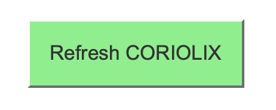

# CTD Configuration in CORIOLIX

These instructions cover the following concepts:

- Delivering CTD data to CORIOLIX
- Assigning CTD sensors to a CTD carousel (CTD Package Configuration)
- Configuring CTD profile plots

Important: The CTD “parent” is the deck box.  A CTD configuration is managed by selecting a deck box as the “parent”, and individual CTD sensors (like temperature) as the “children”.

## CTD Sensors

A list of common CTD sensors follows below for reference.

| Sensor | Model |
|--------|-------|
| Deck unit	|	SBE 11 |
| Main unit | SBE 9plus |
| Temperature	|	SBE 3P |
| Conductivity | SBE 4C |
| pH | SBE 18 |
| Dissolved oxygen | SBE 43 |
| Altimeter | Valeport VA500 |
| Fluorometer | ECOFLRTD |
| PAR cosine | QCP |
| PAR scalar | QSP |
| Radiometer	|	HyperOCR |
| Transmissometer | C-Star |
| Pump | 5T |

## Data Delivery from the CTD to CORIOLIX

### SeaSave

Raw CTD data are delivered up the tether in real-time to the deck box (SBE 11) and from there to a Windows computer (or VM) hosting the SeaBird CTD processing software (SeaSave).  SeaSave can be configured to output the processed CTD data via serial. (Note that SeaSave also has a tcp output option, however the serial data output is more complete.).

| Field | Setting |
|---|---|
| Communication Type	|	RS-232 |
| Serial Details | 9600, N, 1, 8, None |

The serial data feed may be delivered to OpenRVDAS/CORIOLIX via SCS or directly to a port on an OpenRVDAS server.  The remainder of this document assumes that the data travel through SCS.

### SCS

For CTD data delivered via SCS, the CTD data should be configured to be output as a single CTD message on an individual UDP port (e.g. 5201).

| Field | Setting |
|---|---|
| Raw Data Ethernet Distribution | IP Address	|
| Port | 5201 |
| Sample Data Message(s) | 450.447 453.475 7.8191 7.8197 34.5549 34.5420 1488.70 1488.68 2.1443 1029.0146 0.1852 0.0200 134.1880342 99.87 |

The message may be prefixed with extra information from SCS like a timestamp and ID.  If that is the case, the prefixed information will be trimmed from the message by setting the “Number of Fields to Trim” value to 2.

| Field | Setting |
|---|---|
| Number of Fields to Trim	|	2 |

## CTD Sensor Metadata Settings

**All CTD sensors**
| Field | Setting |
|---|---|
| Class | OverTheSide |
| Enabled | True |
| Vessel | *must be assigned to the correct vessel* |
| Location When Installed | CTD Rosette  (or “CTD Rosette - spare”) |
| OpenRVDAS Logging | file and database (file/db) |
| Native Data Feed | *this entire section should be empty* |
| Native Data Format | *this entire section should be empty* |
| Data Processing | NoTransformation |
| Parameters | *Each CTD sensor should have one or more parameters (except the deck box and pump which shouldn’t have any). The parameter “processing_symbol”s must match the names used in the regex pattern (e.g. depth, temperature_1, salinity_1; see the deck box metadata below).* |
| Native Sample Rate | 24 Hz (*or appropriate value*) |

**SBE 11 (deck box)**
| Field | Setting |
|---|---|
| Class | OverTheSide |
| Type | CTD |
| Model |	Sea-Bird SBE 911plus CTD |
| Enabled	|	True |
| Vessel | *must be assigned to the correct vessel* |
| Location When Installed | CTD Rosette (or “CTD Rosette - spare”) |
| Signal type | Digital |
| Comm type | Ethernet (*this assumes the data are from SCS*) |
| Native Data Type | Text |
| Sample Data Message | -10.0799 -1.6706 0.0000 |
| Message Format String | ['^\s*(?P<depth>\-?\d+\.\d*)\s+(?P<temperature_1>\-?\d+\.\d*)\s+(?P<salinity_1>\-?\d+\.\d*)\.*$'] |
| Data Processing Script | NoTransformation |
| Raw Data Ethernet Distribution | IP Broadcast	172.20.20.255 (*change to relevant address*) |
| UDP port | 50201 (*for example*) |
| OpenRVDAS Logger Mode | file and database |

>[!IMPORTANT]
>Settings to watch out for
>- The SBE 11 should not have any parameters.
>- The Message Format String must include a field called “depth” (exactly).  The CTD plots look for a field named “depth” to be used as the Y axis for the CTD profile plots.

**SBE 9 (main profiling unit)**
| Field | Setting |
|---|---|
| Class	|	OverTheSide |
| Type | CTD |
| Model | Sea-Bird SBE 9plus CTD |
| Enabled | True |
| Vessel | *must be assigned to the correct vessel* |
| Location When Installed	|	CTD Rosette (or “CTD Rosette - spare”) |
| Native Data Feed | *this entire section should be empty* |
| Native Data Format | *this entire section should be empty* |
| Data Processing | NoTransformation |
| OpenRVDAS Logger Mode | file and database |
| Parameters | Depth (m) |
| processing_symbol | “depth” |
| Plot Type | “time series” |
| Plot IDs (Group) | A,B,C,D,E,F,G |

>[!IMPORTANT]
>The “depth” parameter from the SBE9 must be assigned to every plot on the “Group” plot page (i.e. the CTD profile plot page). This is because profile plots require depth information.

## CTD Parameter Metadata Settings

Each sensor associated with the CTD carousel (e.g.SBE 3P (temperature)) should have their relevant parameters associated with it.  

Processing Symbol:	temperature_1 (*this is just an example*)

 The processing symbol must match the term used in the “Message Format String” (regex) in the deck box metadata.  The processing symbol is what is used to match the data message value to a specific parameter.  For example, for the deck box message format string:
['^\s*(?P<depth>\-?\d+\.\d*)\s+(?P<temperature_1>\-?\d+\.\d*)\s+(?P<salinity_1>\-?\d+\.\d*)\.*$']
The processing symbol for the temperature value should be “temperature_1” in order to match the message format string.

| Field | Setting |
|---|---|
| Plot Type | time series |
| Plot IDs (Sensor) | A (or B, C, etc.) (*time series plots on the sensor plot page*) |
| Plot IDs (Group) | A (or B, C, etc.) (*CTD profile plots on the CTD plot page*) |

>[!IMPORTANT]
>One of the CTD sensors MUST include a depth parameter and have a processing symbol of “depth”.  This is usually the SBE9.

## CTD Package Configuration

Page: *Settings – CTD Package Configuration – Edit Configuration*

Important: The CTD “parent” for the package is the deck box.  A CTD configuration is managed by selecting a deck box as the “CTD”, and individual CTD sensors (like temperature) as the child “sensors”.  For plotting reasons, a sensor providing depth (e.g. SBE9) should be included as one of the children as depth data are required for CTD profile plots.

On the “CTD Configuration” page, assign individual CTD sensors to the relevant deck box.

In the “CTD” column, select a deck unit from the dropdown list.  This list is created from all sensors of model “Sea-Bird SBE 911plus CTD”.

In the “Sensor” column, select a CTD sensor to be included as part of that package/carousel.  This list is created from all sensors designated as “OverTheSide” (excluding sensors with the model “Sea-Bird SBE 911plus CTD” which are assumed to be deck boxes).

Multiple packages/carousels can be configured on this page using multiple deck boxes.

## CTD Plot Page

This page displays CTD profile plots for all sensor that satisfy the following criteria:
| Field | Setting |
|---|---|
| Class | OverTheSide |
| Enabled | True |
| Plot IDs (Group) | A - Z |

By default the page shows CTD profiles from the last hour.

## Implementing the Changes

To implement this CTD configuration (i.e. start collecting and plotting CTD data), the CORIOLIX system must be “refreshed”.  This will broadcast the changes to OpenRVDAS and restart the data flow.  Note that the “refresh” only applies to the CORIOLIX instance that you are on (i.e. ship or shore, not both).  To implement the changes on both ship and shore, the refresh button must be triggered on each site separately.

To refresh CORIOLIX:
Visit **“Settings – System Management”** and click on the large green **“Refresh CORIOLIX”** button.  This takes about 20 seconds to run.

 

 
## **Python Methods**
| Script | Description |
|---|---|
| gui/forms.py: CTDForm	|	dropdowns for the CTD package configuration page |
| gui/views.py: ctd	|	manages the CTD plots page |
| gui/views.py: ctd_config |  |
| gui/views.py: ctd_form |  |
| gui/views.py: ctd_list_form	|	manages the formsets |
| gui/templates/ctd_config.html |  |
| gui/templates/ctd_list_form.html |  |
| gui/templates/ctdplots.html | the CTD profile plots page (A-Z) |
| dynamicSLSensorProfile.js | the javascript profile code (takes a list of parameters as input)(requires one of the parameters has a processing_symbol of “depth”)
| Database Tables |  |
| Sensor |  |
| Parameter |  |
| SensorGroup (associates parent and children for the CTD carousel) |  |

NOTE regarding plot types:  The only plot types currently implemented on the “Sensor Plot” pages are:
-	time series
-	histogram
-	spectral

