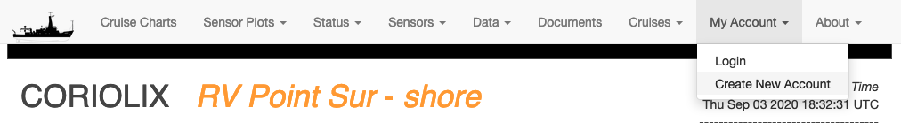

# How to create a CORIOLIX account

At present, most of the CORIOLIX web user interface is available for unauthenticated anonymous users.  However, some core functionality is restricted to named local users who must first register for an account, then login to gain access to the restricted content.

## Restricted content:
Restricted content under each CORIOLIX navigation heading include:

* **Cruise Charts** - *logged in users may save custom user draws routes*
* **Sensor Plots**  - *there are no restricted items under this heading*
* **Status** - *there are no restricted items under this heading*
* **Sensors**
    - **Add/Modify** - *add new sensors or make edits to sensor configurations*
    - **Sensor Logs** - view, edit, or download sensor specific logfiles*
    - **Vendors** - view or edit sensor vendor metadata*
* **Data** - *there are no restricted items under this heading*
* **Documents**
    - **Edit** - *upload or change document metadata*
* **Cruises**
    - **Add New Cruise** - *edit cruise level metadata*
    - **Event Log** - *view, create, or download events & event log*
* **My Account**
    - **My Profile** - *edit your account settings*
    - **My Alerts** - *configure your alerts*
    - **Change My Password** - *reset your password*
* **About** - there are no restricted items under this heading.

## User scope:
Currently, accounts are managed on a per-vessel basis.  That means that we do not yet synchronize your account across the various CORIOLIX vessel specific deployments.  So, if you want to use more on CORIOLIX user interface, Sikuliaq and Savannah for example, you will need to create an account on both systems.

We do synchronize account information between the ship side CORIOLIX installation and the shoreside CORIOLIX installation.  So, you only need to have one account per vessel.  You will use the same username and password for accessing CORIOLIX on the ship as you would on the shore.

## Creating an account for the first time:
Browse to the CORIOLIX site relative to the vessel you are interested in:

#### From the shoreside:
* [https://coriolix.sikuliaq.alaska.edu](https://coriolix.sikuliaq.alaska.edu/
* [https://coriolix.ceoas.oregonstate.edu/ptsur](https://coriolix.ceoas.oregonstate.edu/ptsur)
* [https://coriolix.savannah.skio.uga.edu/](https://coriolix.savannah.skio.uga.edu/)

#### From the shipside:
* [https://10.128.240.84](https://10.128.240.84)
* [https://192.168.1.162](https://192.168.1.162)
* [https://](https://)

From the navigation options at the top of the page, select: *My Account > Create New Account*

Complete the User Profile setup form and select the *Submit* button. Note the email and password that you used.  You'll use these credentials to access CORIOLIX.

## Setting up your user specific alerts:

From the site navigation options select: *My Account > My Alerts*

#### Alert Types:
* Custom User Alerts - Custom alerts work by evaluating sensor parameter value against a threshold condition.  You may combine up to two sensors or sensor parameters per custom alert.
* Proximity Alerts - Proximity alerts evaluate the location of the vessel against geographic points of interest (stations, ports, etc.)
* Temporal Alerts - Temporal alerts evaluate the time now against a datetime parameter for a sensor (e.g. calibration date, warranty expiration date, schedule maintenance data, etc.) that you want to monitor.  Users may set an additional parameter, offset, to receive advance notice of a pending event.
* Sensor Alerts - *Explanation TBD*

Place a check next to any alerts (in the alert table) that you would like to receive.  Existing alerts may be edited using the "Edit" button.  New alerts may be created by using one of the "Create New" buttons.

When your selections have been made, click the "Subscribe to Selected Alerts" button to update your subscriptions.
