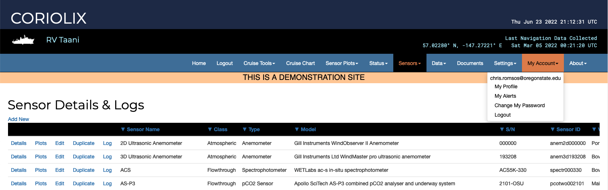
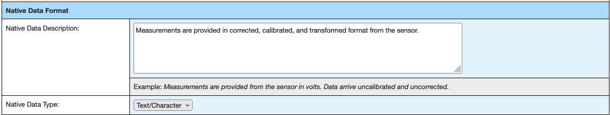
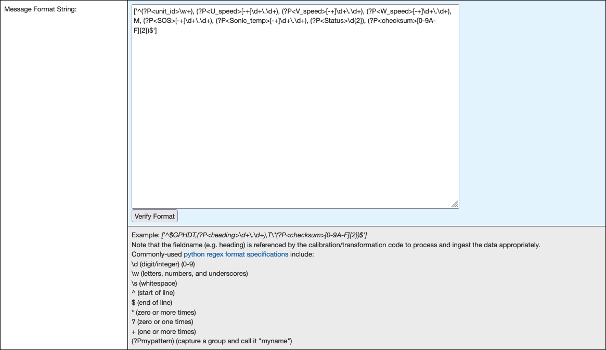
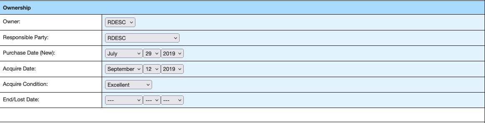
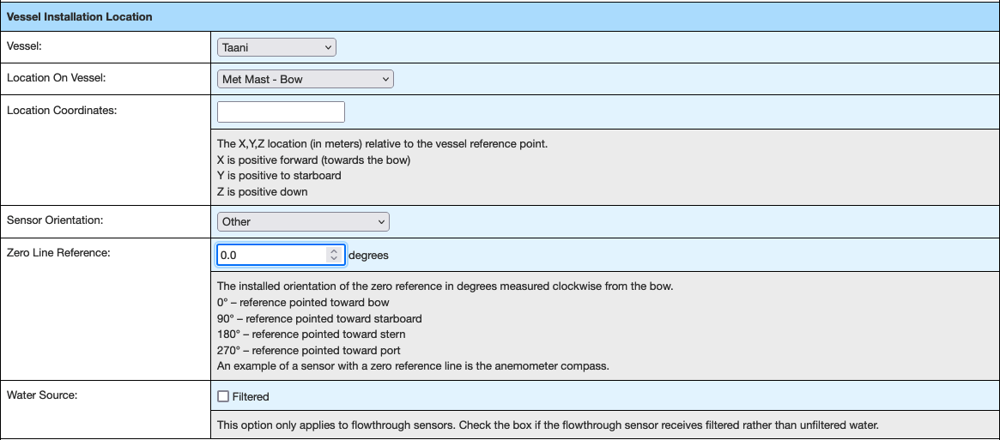
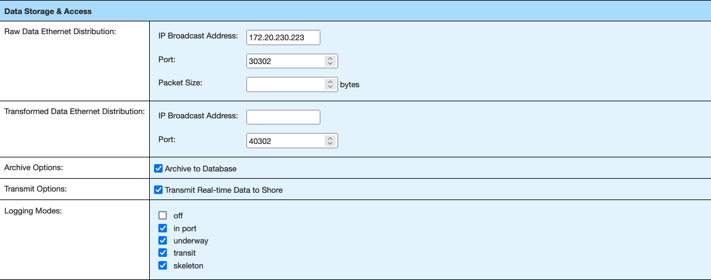
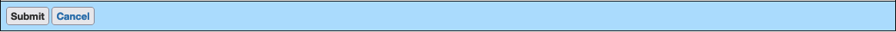

# Onboarding a new instrument to CORIOLIX:

This guide provides an overview of the steps required to incorporate a new sensor
into CORIOLIX.

"Incorporate into CORIOLIX" is meant to encompass any actions needed to connect and communicate with sensor, configure a data logger for the sensor, and access the sensor and its data through CORIOLIX.

This guide assumes that the new sensor has been deployed on the vessel and that the sensor is operational and configured to output RS-232 serial data.

#### Step 1. Create a new sensor in CORIOLIX

Logging data to CORIOLIX first requires the creation of a sensor record in the CORIOLIX database.  Because CORIOLIX manages all phases of the data lifecycle, and not simply logging, it requires us to specify a diverse and comprehensive set of metadata up front.  While all metadata fields are not strictly required, best practice is to maintain all fields.

First, ensure that you are logged in and viewing the Sensor Details & Logs Page. This is where all
new sensor records are created.  Choose the "Add New" option at the top left corner of the Sensor Details and Logs table.  This will load the New sensor setup form.

##### Sensor Overview

- ***Sensor ID*** - 6 digit alphanumeric identifier + last 6 digits of serial number
- ***Sensor Name*** - Name provided by the manufacturer
- ***Class*** - Generic classification used in CORIOLIX for grouping plots and displays
- ***Type*** - Controlled NURC vocabulary options
- ***Vendor*** - Controlled NURC vocabulary options
- ***Serial Number*** - as marked on the instrument
- ***Description*** - Free text

##### Native Data Feed

- ***Signal Type*** - Analog, Digital, or Derived (NOTE: only use Derived for synthetic sensors such as True Winds or similar)
- ***Comm Type*** - Choose the analog carrier or the digital transmission protocol
- ***Serial Details*** - Leave empty for non-serial instruments
- ***Ethernet Details*** - Leave empty for non-ethernet enabled instruments
- ***Native File Details*** - Complete only if the sensor data must be read from a file.

##### Native Data Format

- ***Native Data Description*** - Free text
- ***Native Data Type*** - For digital data types, is the data encoded as text or binary?

- ***Sample Data Message(s)*** - Capture one or more messages from the instrument and add them here for use in developing the Message Format String parsing expression.

- ***Message Format String*** - A regular expression for parsing messages to named variables.  

Using our 3D anemometer example message of "B, -000.08, +000.03, +000.01, M, +344.17, +020.92, 00, 3A"

We want/need to parse out the following 6 values from the message and assign them names:

- unit_id = B
- U_speed = -000.08
- V_speed = 000.03
- W_speed = 000.01
- SOS = 344.17
- Sonic_temp = 20.92
- Status = 00
- checksum = 3A

To build a regex parser, first remember to enclose everything in ['']

- Next add a start of line character, ^, to make: ['^']
- Next add in one open and closed parentheses pair, comma separated, for each value to parse to make: ['^(),(),(),(),(),()']
- Add in any characters for unused message parts to make: ['^(),(),(),(),M,(),()']
- Finally write the unique parse and name assignment regex for each variable and insert into the appropriate positional parenthetical.
- Use the (?<variable_name>regex) format to match patterns and assign names.  
- To parse the letter "B" and assign it to the variable "unit_id" requires this parse string (?P<unit_id>\w+).

Our Message Format String is now: ['^(?P<unit_id>\w+),(),(),(),(),()']

- Continue to build your parse string.  
- Use the Verify Format button to test your parser.

##### Data Processing Script

The data processing script name identifies which pre-written data transformation module to use.  If the message data needs no calibration or transformation, set this value to: NoTransformation

##### Operating Limits

Complete as many of the equipment operating limit information as possible.  This information can be used for QA/QC purposes.

##### Ownership Information

##### Current Physical Status

##### Vessel Installation Location

##### Data Rates

##### Data Storage & Access

##### Time Source

#####Calibration and Maintenance

##### Submit Initial Sensor Configuration

#### Step 2. Configure Sensor Parameters

Only after saving the new sensor, and thus creating a CORIOLIX database record for the instrument, can parameters be added.  Open the sensor edit form again and find the parameters section.

##### Parameter Overview

- ***Parameter Long Name*** - Free text, should be selected from local standard vocabulary
- ***Parameter Short Name*** - Free text, should be selected from local standard vocabulary
- ***Parameter Description*** - Free text,
- ***SAMOS Data Category*** -
- ***Processing Status*** -
- ***Processing Symbol*** - The name or symbol used by the calibration/transformation module to reference this parameter.  Leave blank for sensors implementing NoTransformation.  NOTE: consult the cal/trans module documentation to select the appropriate processing symbol.
- ***Diagnostic Parameter*** -
- ***Internal ID*** - a unique identifier auto generated by CORIOLIX

##### Standard Name & Units
##### Data Value Specifications
##### Database Storage
##### Online Display

#### Step 3. Create an OpenRVDAS sensor to network logger

- SSH to the OpenRVDAS peripheral system that you've already connected your RS-232 instrument to.

- Run the "create_cruise_configuration" script with the wire2net flag set.

- Restart logging on the peripheral OpenRVDAS system

#### Step 4. Create an OpenRVDAS data logger

- SSH to the central OpenRVDAS system

- Run the "create_cruise_configuration" script with the net2db flag set.

- Restart logging on the peripheral OpenRVDAS system

#### Step 5. R.D.W.H.A.H.B.

