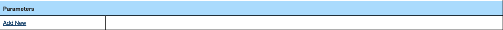

# Step 2: Configure Sensor Parameters

After saving the new sensor record in Step 1, users can now configure the individual parameters that the sensor will collect. Parameters define the specific data variables, their units, processing requirements, and display characteristics.

>[!NOTE]
>This step can only be completed after the sensor record has been created and saved in the CORIOLIX database from Step 1.

## Getting Started

1. Navigate back to the newly created sensor
2. Open the sensor edit form
3. Locate the **Parameters** section



## Adding Parameters

### Parameter Overview


For each parameter the sensor measures, complete the following fields:

| Field | Description | Notes |
|-------|-------------|-------|
| **Parameter Long Name** | Descriptive name | Should be selected from local standard vocabulary |
| **Parameter Short Name** | Abbreviated name | Should be selected from local standard vocabulary |
| **Parameter Description** | Detailed description | Free text explanation of what this parameter measures |
| **SAMOS Data Category** | Classification | Standard oceanographic data category |
| **Processing Status** | Processing requirements | Indicates how data should be processed |
| **Processing Symbol** | Variable reference | Name used by calibration/transformation modules |
| **Diagnostic Parameter** | System flag | Indicates if parameter is for diagnostics |
| **Internal ID** | System identifier | Auto-generated unique identifier by CORIOLIX |

>[!TIP]
>Processing Symbol
>- Leave blank for sensors using `NoTransformation`
>- Consult the calibration/transformation module documentation for appropriate symbols
>- This name must match exactly what the processing module expects

### Standard Name & Units

Define standardized naming and measurement units:

- **Standard Name** - Use recognized oceanographic parameter names when possible
- **Units** - Specify measurement units (e.g., m/s, °C, dbar, psu)
- **Unit Conversion** - Define any necessary unit conversions

### Data Value Specifications

Configure data handling and validation:

- **Expected Range** - Define reasonable min/max values for quality control
- **Precision** - Number of decimal places to maintain
- **Fill Value** - Value to use for missing or invalid data
- **Valid Range** - Absolute limits for data acceptance

### Database Storage

Configure how parameters are stored in the database:

- **Storage Frequency** - How often to save data (every sample, averaged, etc.)
- **Data Type** - Numeric format (float, integer, etc.)
- **Index Options** - Database indexing for query performance
- **Archive Settings** - Long-term storage configuration

### Online Display

Set up real-time display options:

- **Plot Type** - Time series, histogram, scatter, etc.
- **Display Units** - Units for real-time display (may differ from storage)
- **Plot Color** - Color for charts and graphs
- **Y-Axis Range** - Display range for plots
- **Display Priority** - Order in dashboard displays

## Parameter Examples

### Example 1: Wind Speed
```
Long Name: Wind Speed
Short Name: WSPD
Description: Horizontal wind speed measured at 10m height
Units: m/s
Expected Range: 0-50 m/s
Processing Symbol: wind_speed
Plot Type: Time series
Display Color: Blue
```

### Example 2: Sea Surface Temperature
```
Long Name: Sea Surface Temperature
Short Name: SST
Description: Temperature of seawater at vessel intake
Units: °C
Expected Range: -5 to 40 °C
Processing Symbol: sst
Plot Type: Time series
Display Color: Red
```

### Example 3: GPS Latitude
```
Long Name: GPS Latitude
Short Name: LAT
Description: Vessel latitude position from GPS
Units: decimal degrees
Expected Range: -90 to 90
Processing Symbol: latitude
Plot Type: Map position
Display Color: Green
```

## Best Practices

>[!TIP]
>Parameter Configuration Tips
>- Use consistent naming conventions across all sensors
>- Define reasonable data ranges for quality control
>- Choose appropriate precision for your measurement accuracy
>- Use standard oceanographic parameter names when available
>- Document any special processing requirements

## Quality Control Considerations

- **Range Checks** - Set realistic min/max values
- **Rate of Change** - Define maximum acceptable change rates
- **Spike Detection** - Configure spike detection thresholds
- **Missing Data** - Define how to handle data gaps

## Saving Parameters

After configuring each parameter:

1. Review all settings for accuracy
2. Ensure processing symbols match transformation requirements
3. Verify display settings are appropriate
4. Click **"Save Parameter"** to commit the configuration
5. Repeat for all additional parameters

Once all parameters are configured and saved, proceed to [Step 3: Network Logger Setup](HT_sensor_onboard_step3.md).

## Navigation

- **Previous:** [Step 1: Create New Sensor](HT_sensor_onboard_step1.md)
- **Next:** [Step 3: Network Logger Setup](HT_sensor_onboard_step3.md)
- **Overview:** [Sensor Onboarding Guide](HT_sensor_onboard.md)

## Troubleshooting

**Common Issues:**

- **Processing symbol errors:** Ensure symbols match transformation module requirements
- **Unit conversion problems:** Verify unit specifications and conversion factors
- **Display issues:** Check plot type compatibility with data type
- **Range validation failures:** Ensure expected ranges are realistic for your sensor

For additional help, see the [troubleshooting guide](HT_sensor_onboard_troubleshooting.md).
