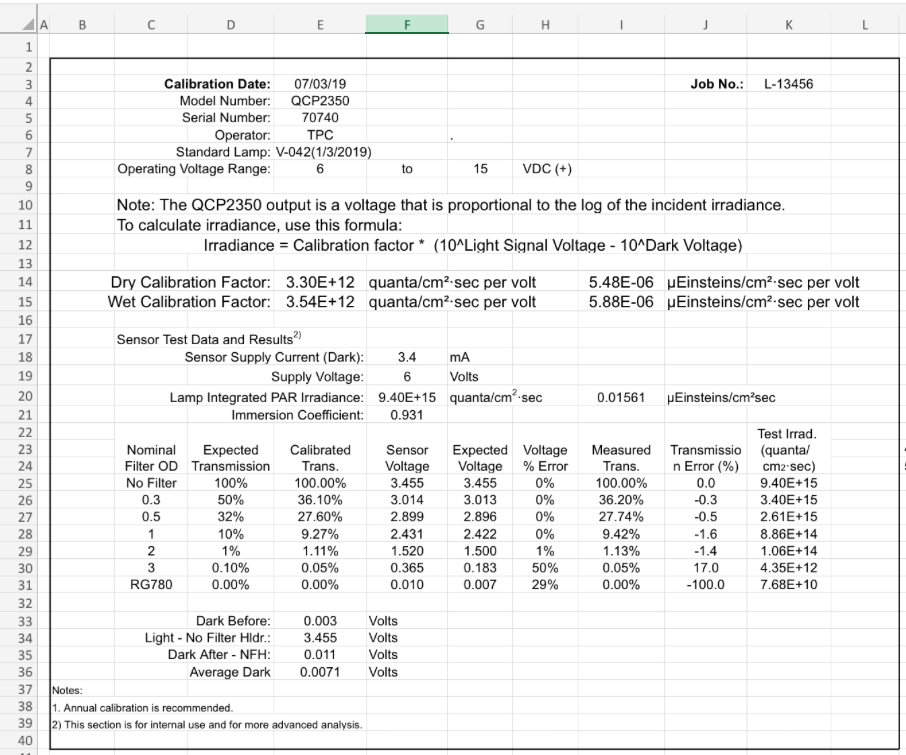
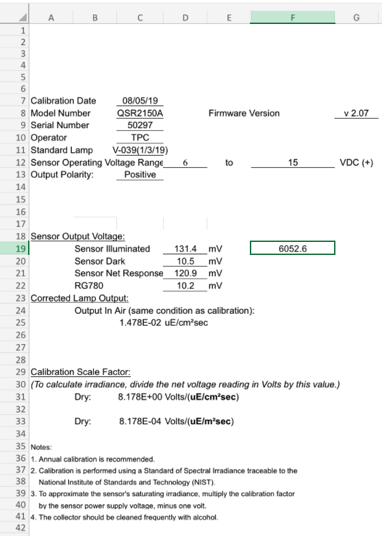
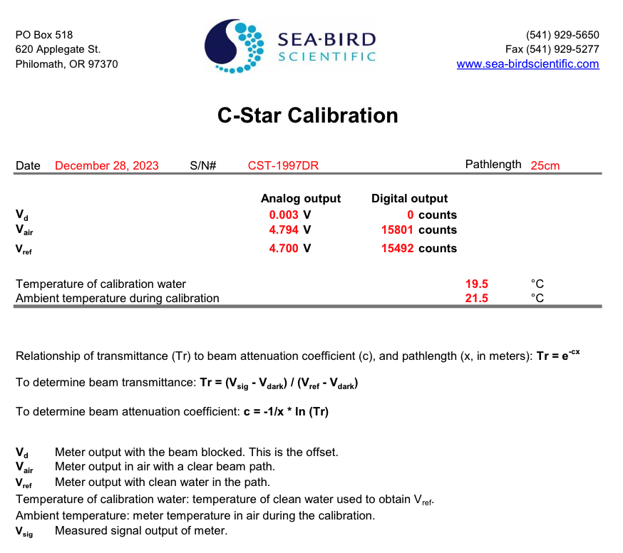
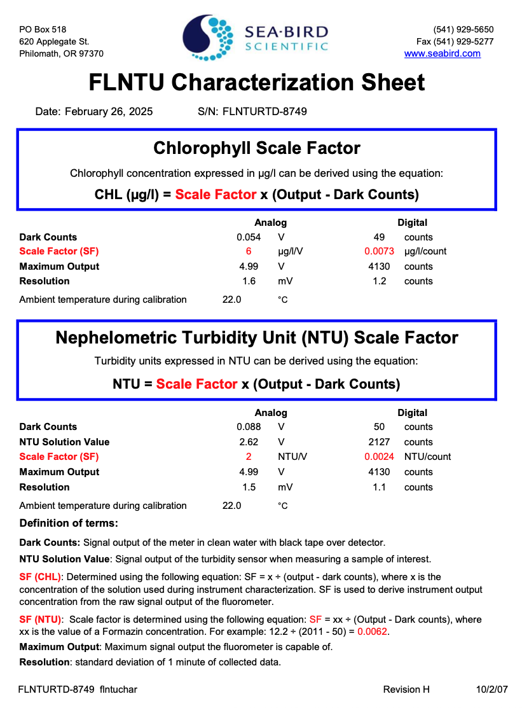
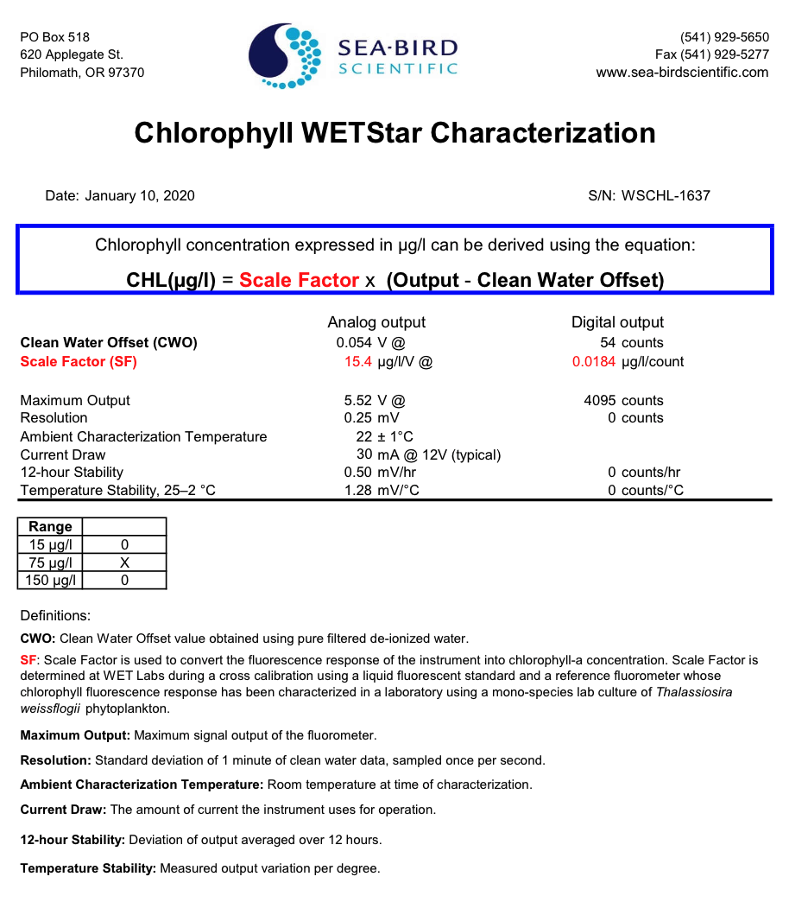

# Step 3: Upload Calibration Files

This step uploads and parses sensor calibration files so calibration coefficients can be applied during data processing.

!!! note "Prerequisites"

    - Sensor record created in CORIOLIX (Step 1)
    - Access to the sensor calibration file(s)

## Overview

For some sensors, calibration coefficients are required to convert measurements from raw engineering units (like volts or counts) to scientific units.
Recent calibration files must be uploaded to CORIOLIX before data collection and processing begins.

During the upload of a calibration file, CORIOLIX will determine whether the file is a parseable calibration file known to CORIOLIX.

If the file is parseable, CORIOLIX will then:

- Parse the uploaded file, extracting the date of calibration and the calibration coefficients
- Store the calibration date and calibration coefficients in a CORIOLIX database table
- Make the calibration information accessible to the data processing code

During real-time processing, the relevant calibration coefficients (based on the calibration date) are applied.

When the file upload is complete, the uploaded file is stored on the server and made available on the CORIOLIX sensor details page and the documents page.

!!! tip "Best Practices"

    - Upload all calibration files and certificates regardless of whether they are needed for processing or not
    - If a parseable copy needs to be made of a calibration file, upload both the parseable version and original version
    - Fill out the document upload form as completely as possible
    - Assign calibration files to the document category "Calibration File(s)"
    - Assign the calibration file to the specific sensor it applies to

## Required Sensor Calibration Files

| Sensor Model | Processing Script | Calibration File Extension(s) | Available from Manufacturer | Details |
|-----------|---------|---------|---------|---------|
| Biospherical Instruments QCR-2150 surface PAR sensor | QCR2150 | .xlsx | no (PDF only) | [details](#qxr2150) |
| Biospherical Instruments QSR 2150 surface reference radiometer | QSR2150 | .xlsx | no (PDF only) | [details](#qxr2150) |
| Biospherical Instruments QCP-2350 underwater PAR sensor | QCP2350 | .xlsx | no (PDF only)  | [details](#qxp2350) |
| Biospherical Instruments QSP-2350 underwater PAR sensor | QSP2350 | .xlsx | no (PDF only)  | [details](#qxp2350) |
| Satlantic {Sea-Bird} HyperOCR spectroradiometer series | HyperOCR | .cal | yes | [details](#hyperocr) |
| Satlantic {Sea-Bird} SeaFET V2 (shallow) pH sensor | SeaFETV2 | .cal | no (PDF only) | [details](#seafetv2) |
| Satlantic {Sea-Bird} Submersible Ultraviolet Nitrate Analyser V2 (SUNA V2) nutrient analyser series | SUNAV2 | ZCoefDat.cal and .cal | yes | [details](#sunav2) |
| Sea-Bird SBE 3 | SBE3 | .cal | yes | [details](#sbe3) |
| Sea-Bird SBE 4 | SBE4 | .cal | yes | [details](#sbe4) |
| Sea-Bird SBE 9plus CTD | SBE9Plus | .cal or .xml | yes | [details](#sbe9plus) |
| Sea-Bird SBE 11plus V2 deck unit | SBE11Plus | .xmlcon | yes | [details](#sbe11plus) |
| Sea-Bird SBE 18 pH Sensor | SBE18 | .xml | yes | [details](#sbe18) |
| Sea-Bird SBE 38 thermometer | SBE38 | .cal | yes | [details](#sbe38) |
| Sea-Bird SBE 43 Dissolved Oxygen Sensor | SBE43 | .cal | yes | [details](#sbe43) |
| Sea-Bird SBE 45 MicroTSG thermosalinograph | SBE45 | .cal | yes | [details](#sbe45) |
| Sunburst Autonomous Flow Through Instrument {AFT-CO2} pCO2 sensor | AFTCO2 | .cal | yes | [details](#aftco2) |
| WET Labs {Sea-Bird WETLabs} ac-s in-situ spectrophotometer | ACS | .dev | yes | [details](#acs) |
| WET Labs {Sea-Bird WETLabs} C-Star transmissometer | CStar | .cal | no (PDF only) | [details](#cstar) |
| WET Labs {Sea-Bird WETLabs} ECO FLNTU(RT)D combined fluorometer and turbidity sensor | Flnturtd | .cal | no (PDF only) | [details](#flnturtd) |
| WET Labs {Sea-Bird WETLabs} ECO FL(RT)D fluorometer | Flrtd | .dev (but iengr.dev will be ignored) | yes | [details](#flrtd) |
| WET Labs {Sea-Bird WETLabs} ECO Triplet BB2FL scattering fluorescence sensor | ecotripletbb2fl | .dev | yes | [details](#ecobb2fl) |
| WET Labs {Sea-Bird WETLabs} ECO Triplet BB3RT2K scattering sensor| ecotripletbb3 | .dev | yes | [details](#ecobb3) |
| WET Labs {Sea-Bird WETLabs} ECO Triplet BBFL2 scattering fluorescence sensor | ecotripletbbfl2 | .dev | yes | [details](#ecobbfl2) |
| WET Labs {Sea-Bird WETLabs} ECO Triplet FL3 fluorescence sensor | ecotripletfl3 | .dev | yes | [details](#ecofl3) |
| WET Labs {Sea-Bird WETLabs} WETStar fluorometer | WETStar | .cal | no (PDF only) | [details](#wetstar) |


## Example Calibration Files

---
### QXP2350
*Biospherical Instruments QCP-2350 / QSP-2350 underwater PAR sensor*

Biospherical Instruments provides their calibration files in PDF format only.  A parseable file (in .xlsx format) must be made manually for CORIOLIX by copying the contents of the PDF into an Excel workbook.
A template is available here:
[BSI_QXP2350_PAR_CalibrationTemplate.xlsx](sensor_cals/BSI_QXP2350_PAR_CalibrationTemplate.xlsx)

The first sheet in the workbook must contain the following items in the specified row/column locations.

| Row | Column | Type | Content | Example |
|-----|-----|------|------------|-------------|
| 2 | D | text | 'Calibration Date:' | Calibration Date: |
| 2 | E | text | *calibration date* | 07/03/19 |
| 3 | D | text | 'Model Number:' | Model Number: |
| 3 | E | text | *model number* | QCP2350 |
| 4 | D | text | 'Serial Number:' | Serial Number: |
| 4 | E | text | *serial number* | 70745 |
| 13 | D | text | 'Dry Calibration Factor:' | Dry Calibration Factor: |
| 13 | E | float | *dry cal factor q/cm2/s/V* | 2.94E+12 |
| 13 | I | float | *dry cal factor uE/cm2/s/V* | 4.88E-06 |
| 14 | D | text | 'Wet Calibration Factor:' | Wet Calibration Factor: |
| 14 | E | float | *wet cal factor q/cm2/s/V* | 3.16E+12 |
| 14 | I | float | *wet cal factor uE/cm2/s/V* | 5.24E-06 |
| 35 | D | text | 'Average Dark:' | Average Dark: |
| 35 | E | float | *average dark volts>*| 0.0094 |



---
### QXR2150
*Biospherical Instruments QCR2150 / QSR2150 surface PAR sensor*

Biospherical Instruments provides their calibration files in PDF format only.  A parseable file (in .xlsx format) must be made manually for CORIOLIX by copying the contents of the PDF into an Excel workbook.
A template is available here:
[BSI_QXR2150_PAR_CalibrationTemplate.xlsx](sensor_cals/BSI_QXR2150_PAR_CalibrationTemplate.xlsx)

The first sheet in the workbook must contain the following items in the specified row/column locations.

| Row | Column | Type | Content | Example |
|-----|-----|------|------------|-------------|
| 7 | A | text | 'Calibration Date' | Calibration Date |
| 7 | C | text | *calibration date* | 07/03/19 |
| 8 | A | text | 'Model Number' | Model Number |
| 8 | C | text | *model number* | QCR2150A |
| 9 | A | text | 'Serial Number' | Serial Number |
| 9 | C | text | *serial number* | 50300 |
| 20 | B | text | 'Sensor Dark' | Sensor Dark |
| 20 | D | float | *dark mv* | 10.2 |
| 31 | B | text | 'Dry:' | Dry: |
| 31 | C | float | *dry cal factor uE/cm2/s* | 7.935E+00 |
| 33 | B | text | 'Dry:' | Dry: |
| 33 | C | float | *dry cal factor uE/m2/s* | 7.935E-04 |



---
### HyperOCR
*Satlantic {Sea-Bird} HyperOCR spectroradiometer series*

This calibration file is provided by Sea-Bird in a parseable format known to CORIOLIX.  This file should be uploaded without modification.

Example: HED2005A.cal
```
SATLANTIC HYPER-OCR Hyperspectral Radiometer
Instrument Identification: SATHSE2005 / Spec Number 125460
OREGON STATE UNIVERSITY / 305574573 / ASY-SPC-00063
Generated by  rlamb |Instrument Serial 2005 |Start Channel 2 |End Channel 181 |Coefficients 301.125,3.30338,5.1603E-4,-2.12064E-6

Calibration History
Date       |Operator |SW Version |Rev |Type |Int Time |Raw Data   |Lamp         |Target       |Distance |Output wavelengths(channels) |Display wavelengths(channels) | Comments
------------------------------------------------------------------------------------------------------------------------------------------------------------------------------------------
2019-10-29-11-21-47 |rlamb    |1.9.23_30  |A   |ES   |256.0    |clAj2005f-2005_2019-10-29_10-40-48_raw |F1573        |             |50.0     |307.73 to 903.37 (2-181)    |350.78 to 804.4 (15-151)      | Final Calibration,


INSTRUMENT SATHED '' 6 AS 0 NONE
SN 2005 '' 4 AI 0 COUNT

Current Integration Time
INTTIME ES 'sec' 2 BU 1 POLYU
0  0.001

Sample Delay
SAMPLE DELAY 'sec' 2 BU 1 POLYU
0  0.001

Average SPECTEMP during calibration
CALTEMP 22.97 'C' 0 BU 0 NONE

Thermal Responsivity derived value
THERMAL_RESP NONE '' 0 BU 1 THERM1
-0.01131601	4.95350e-05	-7.488197e-08	4.33976e-11	20.0

Spectrum Data

ES 307.73 'uW/cm^2/nm' 2 BU 0 NONE

ES 311.04 'uW/cm^2/nm' 2 BU 0 NONE

... (more like the above)

ES 350.78 'uW/cm^2/nm' 2 BU 1 OPTIC3
333.245	1.39752358366e-003	1.000	0.256

.... (more like the above)
```

---
### SeaFETV2
*Satlantic {Sea-Bird} SeaFET V2 (shallow) pH Sensor*

The calibration sheet for the SeaFET is available in PDF format only from Sea-Bird. To make a parseable version for CORIOLIX, the contents of this file must be manually copied over to a text file in the exact format shown below. Replace the values in the example with those from the PDF calibration sheet.

The new text file name must end in '.cal'.  It is recommended that the SeaFET serial number and the calibration date be included in the filename (e.g. PHS2107_Sep2019.cal).

Example: PHS2107_Sep2019.cal
```
phcaldate=17-Sep-19
k0=-1.4109710000155509
k2=-0.001038585241770624
kdf0=-1.420183000014793
kdf2=-0.0012210740472797083
tdfcaldate=nominal
tdfa0=-0.001542604
tdfa1=0.0005451845
tdfa2=-1.988318e-05
tdfa3=4.501564e-07
```

---
### SUNAV2
*Satlantic {Sea-Bird} Submersible Ultraviolet Nitrate Analyser V2 (SUNA V2) nutrient analyser series*

These calibration files are provided by Sea-Bird in a parseable format known to CORIOLIX.  These files should be uploaded without modification.

Example: SNA1221A.cal
```
H,SUNA 1221 Cal A  extinction coefficients and reference spectra
H,File generated by Internal Software Suite 1.9.23_30
H,File format version 3
H,File creation time 14-Nov-2018 14:00:00
H,Operator production
H,PATH_LENGTH 10
H,INT_PERIOD 350
H,CONC_CAL_NO3 40.00
H,CONC_CAL_SWA 34.50
H,T_S_CORRECTABLE
H,T_CAL 20.00
H,T_CAL_SWA 20.00
H,NitrateFile SUNA_1221_001.xml
H,DIW Log file SUNA1221_CAL02_DIW_1.raw
H,LNSW Log file SUNA1221_CAL02_LNSW_1.raw
H,Nitrate in LNSW Log file SUNA1221_CAL02_NO3_1.raw
H,Wavelength,nm
H,NITRATE,uM
H,AUX1,none
H,AUX2,none
H,Reference,counts
H,Wavelength,NO3,SWA,TSWA,Reference
E,190.86,0.00205293,-0.00181250,-0.00193690,28.00
E,191.65,0.00637891,0.00353398,0.00370432,33.00
E,192.45,-0.00581913,0.00170472,0.00175229,25.00
E,193.24,0.00185718,-0.00748449,-0.00754623,26.00
....
```

Example: ZCoefDat.cal
```
/* Satlantic SUNA V2 1221, CRO-MMS UV II 114244  ***************************/
/* Polynomial Coefficients for Wavelength Calculation from pixel value.   */
/* DO NOT MODIFY FORMAT, i.e, values MUST be preceeded by their coefficent*/
/* designator AND comment strings must have either a '/' or '*' in them.  */
/*                                                                        */
/* Entered by: jye */
/* Date: Wed Nov 07 12:50:34 PST 2018                                                    */
/**************************************************************************/
C0 00000190.070000000
C1 00000000.792215000
C2 00000000.0000870988
C3 -00000000.000000296767
C4 00000000.000000000
```


---
### SBE3
*Sea-Bird SBE 3*

This calibration file is provided by Sea-Bird in a parseable format known to CORIOLIX.  This file should be uploaded without modification.

Example: 6330.cal
```
INSTRUMENT_TYPE=SBE3
SERIALNO=6330
TCALDATE=21-Nov-19
TG= 4.40954981e-003
TH= 6.39144688e-004
TI= 2.26256054e-005
TJ= 2.14123823e-006
TF0=1000.0
```

---
### SBE4
*Sea-Bird SBE 4*

This calibration file is provided by Sea-Bird in a parseable format known to CORIOLIX.  This file should be uploaded without modification.

Example: 4901.cal
```
INSTRUMENT_TYPE=SBE4
SERIALNO=4901
CCALDATE=31-Oct-19
CG=-1.00684143e+001
CH= 1.38402234e+000
CI=-4.57597973e-004
CJ= 9.84127233e-005
CTCOR= 3.25000e-006
CPCOR=-9.57000e-008
```

---
### SBE9plus
*Sea-Bird SBE 9plus CTD*

These calibration files are provided by Sea-Bird in a parseable format known to CORIOLIX.  These files should be uploaded without modification. Only one of the two available formats (.cal or .xml) needs to be uploaded as they both contain the same information.

Example: 1398.cal
```
PCALDATE = 20-Aug-19
C1=-4.956404e+004
C2=-3.634693e-001
C3= 1.373090e-002
D1= 4.005200e-002
D2= 0.000000e+000
T1= 3.005325e+001
T2=-3.076830e-004
T3= 3.568740e-006
T4= 1.987660e-009
T5= 0.000000e+000
AD590M= 1.28000e-002
AD590B=-9.21040e+000
SLOPE= 0.99997
OFFSET= 0.2445
```

Example: 1398.xml
```
<?xml version="1.0" encoding="UTF-8"?>
<PressureSensor SensorID="45" SB_ConfigCTD_FileVersion="7.23.0.2" >
<SerialNumber>1394</SerialNumber>
<CalibrationDate>01-Aug-19</CalibrationDate>
<C1>-4.606670e+004</C1>
<C2>-5.329727e-001</C2>
<C3>1.032900e-002</C3>
<D1>3.741900e-002</D1>
<D2>0.000000e+000</D2>
<T1>3.014224e+001</T1>
<T2>-4.470760e-004</T2>
<T3>3.054870e-006</T3>
<T4>3.448380e-009</T4>
<Slope>1.00009554</Slope>
<Offset>-0.55461</Offset>
<T5>0.000000e+000</T5>
<AD590M>1.279120e-002</AD590M>
<AD590B>-9.415990e+000</AD590B>
</PressureSensor>
```

---
### SBE11plus
*Sea-Bird SBE 11plus V2 deck unit*

This is a combination calibration file.  The format and contents depend on which sensors are installed on the CTD.

Sensors currently supported include:

- SBE 3plus (temperature)
- SBE 4C (conductivity)
- SBE 9plus (pressure)
- SBE 43 (oxygen)
- ECO FLRTD

---
### SBE18
*Sea-Bird SBE 18 pH sensor*

This calibration file is provided by Sea-Bird in a parseable format known to CORIOLIX.  This file should be uploaded without modification.

```
<?xml version="1.0" encoding="UTF-8"?>
<pH_Sensor SensorID="43" SB_ConfigCTD_FileVersion="7.23.0.2" >
  <SerialNumber>1467</SerialNumber>
  <CalibrationDate>13-Aug-19</CalibrationDate>
  <Slope>4.6098</Slope>
  <Offset>2.5007</Offset>
</pH_Sensor>
```

---
### SBE38
*Sea-Bird SBE 38 thermometer*

This calibration file is provided by Sea-Bird in a parseable format known to CORIOLIX.  This file should be uploaded without modification.

Example: 1109.cal
```
SBE38
SERIALNO=1109
CALDATE=18-Aug-19
A0= 3.173283e-005
A1= 2.754951e-004
A2=-2.357410e-006
A3= 1.533953e-007
```

---
### SBE43
*Sea-Bird SBE 43 Dissolved Oxygen Sensor*

This calibration file is provided by Sea-Bird in a parseable format known to CORIOLIX.  This file should be uploaded without modification.

Example: 0140.cal
```
INSTRUMENT_TYPE=SBE43
SERIALNO=0140
OCALDATE=28-Sep-18
SOC= 4.188185e-001
VOFFSET=-7.267066e-001
A=-5.089643e-003
B= 1.797253e-004
C=-2.846062e-006
E= 3.600000e-002
Tau20= 1.310000e+000
```

---
### SBE45
*Sea-Bird SBE 45 MicroTSG thermosalinograph*

This calibration file is provided by Sea-Bird in a parseable format known to CORIOLIX.  This file should be uploaded without modification.

Example: 0710.cal
```
SERIALNO=0710
TCALDATE=19-Sep-19
TA0=-5.693131e-005
TA1= 2.854055e-004
TA2=-3.098408e-006
TA3= 1.721663e-007
CCALDATE=19-Sep-19
CG=-9.961478e-001
CH= 1.490572e-001
CI=-3.849583e-004
CJ= 5.339274e-005
CTCOR=3.250000e-006
CPCOR=-9.570000e-008
WBOTC=1.929733e-007
```

---
### AFTCO2
*Sunburst Autonomous Flow Through Instrument {AFT-CO2} pCO2 sensor*

This calibration file is provided by Sunburst in a parseable format known to CORIOLIX.  This file should be uploaded without modification.

Example: AC17_20230802.cal
```
SAMI CO2 Calibration Certificate
Serial Number: AC17
Date: August 2, 2023

A=0.0656
B=0.5202
C=-1.3426
T=11.7501
```

---
### ACS
*WET Labs {Sea-Bird WETLabs} ac-s in-situ spectrophotometer*

This calibration file is provided by Sea-Bird in a parseable format known to CORIOLIX.  This file should be uploaded without modification.

Example: acs330.dev
```
ACS Meter
5300014A		; Serial number
3	; structure version number
"tcal: 17.9 C, ical: 19.4 C. The offsets were saved to this file on 12/19/2019."
0	0		; Depth calibration
115200			; Baud rate
0.25			; Path length (meters)
84			; output wavelengths
34			; number of temperature bins
1.828811	2.353392	3.414821	4.485714	5.502308	6.481739	7.532857	8.514167	9.50125	10.5075	11.49625	12.4896	13.504167	14.49125	15.472917	16.4772	17.500769	18.494583	19.5008	20.495417	21.494231	22.5036	23.4944	24.513462	25.5008	26.495385	27.497692	28.494074	29.496154	30.48963	31.487857	32.495357	33.483548	34.519412	; temperature bins
C400.1	A401.2	8	-0.02197	-0.765369		-0.026431	-0.026218	-0.024475	-0.020458	-0.02162	-0.019749	-0.019209	-0.018626	-0.015985	-0.016418	-0.014121	-0.013488	-0.009609	-0.009583	-0.007697	-0.008195	-0.006896	-0.007105	-0.005529	-0.003897	-0.003756	-0.00257	-0.001276	-0.000837	0	0.000905	-0.000207	0.000177	0.000713	0.000763	0.000262	-0.000222	0.000724	0.001867		-0.063562	-0.057091    0.049803	-0.043493	-0.040465	-0.034433	-0.034754	-0.032043	-0.029164	-0.029147	-0.025432	-0.024546	-0.023016	-0.019097	-0.016954	-0.017644	-0.014709	-0.011848	-0.009442	-0.009403	-0.006476	-0.005674	-0.001336	0.000349	0	0.007468	0.008015	0.010273	0.010118	0.014299	0.016227	0.017513	0.017693	0.019199		"; C and A offset, and C and A temperature correction info"
0	0	0	0	0	0	0	0	0	0	0	; maxANoise	maxCNoise	maxANonConform	maxCNonConform	maxADifference	maxCDifference	minACounts	minCCounts	minRCounts	maxTempSdev	maxDepthSdev
```

---
### CStar
*WET Labs {Sea-Bird WETLabs} C-Star transmissometer*

For the C-Star transmissometer, WET Labs provides a PDF version of the calibration file only.  To make a parseable version for CORIOLIX, the contents of this file must be manually copied over to a text file in the exact format shown below. Replace the values in the example with those from the PDF calibration sheet.

The new text file name must end in '.cal'.  It is recommended that the CStar serial number and the calibration date be included in the filename (e.g. CST1997DR_Dec2023.cal).

Example: CST1997DR_Dec2023.cal

```
INSTRUMENT_TYPE=C-Star
SERIALNO=CST-1997DR
CALDATE=28-Dec-23
PATHLENGTH= 25
A_Vdark= 0.003
A_Vair= 4.794
A_Vref= 4.700
D_Vdark= 0
D_Vair= 15801
D_Vref= 15492
```

The original PDF version of the above calibration file is shown below:


After creating the new .cal file, upload both the original PDF file and the new .cal file to CORIOLIX separately.  CORIOLIX will automatically parse the .cal version.

---
### FLNTURTD
*WET Labs {Sea-Bird WETLabs} ECO FLNTU(RT)D combined fluorometer and turbidity sensor*

For the ECO FLNTU(RT)D, WET Labs provides a PDF version of the calibration file only.  To make a parseable version for CORIOLIX, the contents of this file must be manually copied over to a text file in the exact format shown below. Replace the values in the example with those from the PDF calibration sheet.

The new text file name must end in '.cal'.  It is recommended that the FLNTU serial number and the calibration date be included in the filename (e.g. FLNTURTD8749_Feb2025.cal).

Example: FLNTURTD8749_Feb2025.cal

```
INSTRUMENT_TYPE=FLNTURTD
SERIALNO=FLNTURTD-8749
CALDATE=26-Feb-25
CHL_A_DC= 0.054
CHL_A_SF= 6
CHL_D_DC= 49
CHL_D_SF= 0.0073
NTU_A_DC= 0.088
NTU_A_SF= 2
NTU_D_DC= 50
NTU_D_SF= 0.0024
```

The original PDF version of the above calibration file is shown below:


After creating the new .cal file, upload both the original PDF file and the new .cal file to CORIOLIX separately.  CORIOLIX will automatically parse the .cal version.

---
### FLRTD
*WET Labs {Sea-Bird WETLabs} ECO FL(RT)D fluorometer*

This calibration file is provided by Sea-Bird in a parseable format known to CORIOLIX.  This file should be uploaded without modification.

Example: FLRTD-5876.dev
```
ECO 	FLRTD-5876
Created on: 	9/4/2019

:     	chl=ug/l
:       LSS=NTU
: 	"iengrunits = µg/l for CHL, PC, PE. Ppb for CDOM and uranine."
: 	column 5 = input scale factor and offset.

maxvoltage=	4.975
asv1=	6.2808
asv2=	12.5645
asv4=	25.1403

COLUMNS=5
N/U=1
N/U=2
N/U=3
CHL=4	0.0077	49
N/U=5
```

---
### ECOBB2FL
*WET Labs {Sea-Bird WETLabs} ECO Triplet BB2FL scattering fluorescence sensor*

This calibration file is provided by Sea-Bird in a parseable format known to CORIOLIX.  This file should be uploaded without modification.

Example: BB2FL-5899.dev

```
ECO BB2FL-5899
Created on: 09/10/19


Columns=9
N/U=1
N/U=2
N/U=3
Lambda=4	3.875-06	49	650	650
N/U=5
Lambda=6    	2.384e-06	50	880	880
N/U=7
cdom=8		0.091		50
N/U=9
```

---
### ECOBB3
*WET Labs {Sea-Bird WETLabs} ECO Triplet BB3RT2K scattering sensor*

This calibration file is provided by Sea-Bird in a parseable format known to CORIOLIX.  This file should be uploaded without modification.

Example: BB3RT2K-5867.dev

```
ECO BB3RT2K-5867
Created on: 09/05/19


Columns=9
N/U=1
N/U=2
N/U=3
lambda=4	1.177e-05	50	470	470
N/U=5
lambda=6	8.196e-06	47	532	532
N/U=7
lambda=8	3.342e-06	47	700	700
N/U=9
```

---
### ECOBBFL2
*WET Labs {Sea-Bird WETLabs} ECO Triplet BBFL2 scattering fluorescence sensor*

This calibration file is provided by Sea-Bird in a parseable format known to CORIOLIX.  This file should be uploaded without modification.

Example: BBFL2-6921.dev

```
ECO BBFL2-6921
Created on: 06/24/21


Columns=9
N/U=1
N/U=2
N/U=3
lambda=4	2.466e-06	40	650	650
N/U=5
chl=6  		0.0073 		48
N/U=7
cdom=8		0.0906		50
N/U=9
```

---
### ECOFL3
*WET Labs {Sea-Bird WETLabs} ECO Triplet FL3 fluorescence sensor*

This calibration file is provided by Sea-Bird in a parseable format known to CORIOLIX.  This file should be uploaded without modification.

Example: FL3-5881.dev

```
ECO 	FL3-5881
Created on: 	08/28/19


COLUMNS=9
N/U=1
N/U=2
N/U=3
Chl=4   	0.0121		49
N/U=5
Phycoerythrin=6	0.0425		50
N/U=7
Phycocyanin=8		0.0425		50
N/U=9
```

---
### WETStar
*WET Labs {Sea-Bird WETLabs} WETStar fluorometer*

For the WETStar fluorometer, WET Labs provides a PDF version of the calibration file only.  To make a parseable version for CORIOLIX, the contents of this file must be manually copied over to a text file in the exact format shown below. Replace the values in the example with those from the PDF calibration sheet.

The new text file name must end in '.cal'.  It is recommended that the WETStar serial number and the calibration date be included in the filename (e.g. WSCHL1637_Jan2020.cal).

Example: WSCHL1637_Jan20.cal (originally a PDF)

```
INSTRUMENT_TYPE=WSCHL
SERIALNO=1637
CALDATE=10-Jan-20
A_CWO= 0.054
A_SF= 15.4
D_CWO= 54
D_SF= 0.0184
```

The original PDF version of the above calibration file is shown below:


After creating the new .cal file, upload both the original PDF file and the new .cal file to CORIOLIX separately.  CORIOLIX will automatically parse the .cal version.

---
