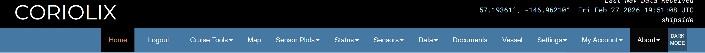

# About Menu – Overview for Basic Users

The **About** dropdown provides background information about CORIOLIX, system updates, data standards, and support contacts.

The About menu contains five informational sections:

1. **About This Site** – System version, development, and citation information  
2. **Release Notes** – Version history and feature changes  
3. **Vocabularies & Codes** – External standards and code systems used by CORIOLIX  
4. **Contact Us** – Support and feedback information  
5. **Documentation** – Link to full CORIOLIX documentation  

---

## About This Site

The About This Site page provides system-level information about the current CORIOLIX installation.

### Overview

This section includes:

- The current CORIOLIX version and release date  
- Development and funding information  
- Citation formats for publications  

### Data Status

- The data displayed in CORIOLIX is **provisional underway data**.  
- It should **not be used for formal scientific analysis or cruise planning** without verifying against the official dataset provided by vessel scientific support staff.  

### Development & Funding

- CORIOLIX is developed by the RCRV Datapresence team at Oregon State University.  
- Funding is provided by the National Science Foundation.  

### Citation Guidance

Citation formats are provided for:

- Academic publications  
- Technical reports  
- Software references  

Users not publishing or formally referencing CORIOLIX do not need to use this section.

---

## Release Notes

The Release Notes page documents changes between CORIOLIX versions.

### Overview

Release notes may include:

- New features  
- Interface updates  
- Performance improvements  
- Renamed fields  
- API changes  
- Deprecated features  
- Bug fixes  

### What Most Users Should Review

Most users only need to review:

- Newly added features  
- Interface or layout changes  
- Major version updates  

Backend database and API changes primarily affect developers and data managers.

---

## Vocabularies & Codes

The Vocabularies & Codes page lists the external standards and code systems used within CORIOLIX.

### Overview

CORIOLIX uses internationally recognized vocabularies rather than locally defined terminology.

Each category links to an external standards organization that maintains the official terminology. These links are provided for:

- Transparency  
- Traceability  
- Technical reference  

Users do not need to visit these sites during normal operation. The vocabularies define the standardized terms used in dropdown menus and metadata fields.

---

### Why External Vocabularies Are Used

Using established external standards:

- Prevents inconsistent naming  
- Ensures compatibility with national data repositories  
- Supports integration with ERDDAP  
- Improves long-term data archiving  
- Aligns shipboard data with international conventions  

These vocabularies are maintained and periodically updated by external organizations.

---

### Vocabulary Reference Table

| Category | Standard Used | Maintained By | Purpose |
|-----------|--------------|---------------|----------|
| **Device Types** | R2R Device Type Vocabulary | Rolling Deck to Repository (R2R) | General sensor classification |
| **Devices (Sensor Models)** | SeaVoX Device Catalogue (L22) | NERC Vocabulary Server (NVS) | Standardized instrument models |
| **Parameters (Short Names)** | CF Standard Names | CF Conventions Community | International scientific variable naming |
| **Sensor Manufacturers** | SeaVoX Developers & Manufacturers (L35) | NERC Vocabulary Server (NVS) | Standardized manufacturer names |
| **IOOS Categories** | IOOS Core Variables | IOOS / ERDDAP | Broad scientific data categories |
| **Event Log Processes** | SeaVoX Event Processes (EL2) | NERC Vocabulary Server (NVS) | Standardized operational process terms |
| **Event Log Actions** | SeaVoX Event Actions (EL1) | NERC Vocabulary Server (NVS) | Standardized event action terms |
| **Vessel Codes** | SeaDataNet Ship & Platform Codes (SHIPC) | ICES | International vessel identifiers |
| **Port Codes** | UN/LOCODE | UNECE | International port identifiers |

---

### What This Means for Users

- CORIOLIX does not create its own terminology.  
- Dropdown selections use internationally maintained standards.  
- Names and codes remain consistent across vessels and repositories.  
- Data exported from CORIOLIX aligns with global marine data standards.  

For most users, these standards operate in the background.

---

## Contact Us

The Contact Us section provides support and feedback options.

### When to Use This Section

Use this section if you:

- Notice incorrect data  
- Experience technical issues  
- Have feature requests  
- Need clarification  

### Available Support Methods

Users may:

- Use the green **Feedback** button  
- Email CORIOLIX support  
- Contact specific team members directly  

The system is actively developed, and user feedback is encouraged.

---

## Documentation

The Documentation section links to the full CORIOLIX documentation site.

### Use the Documentation Site For

- Step-by-step guides  
- Feature explanations  
- Workflow examples  
- Operational instructions  
- API usage (if applicable)  

---

## Related Documentation
