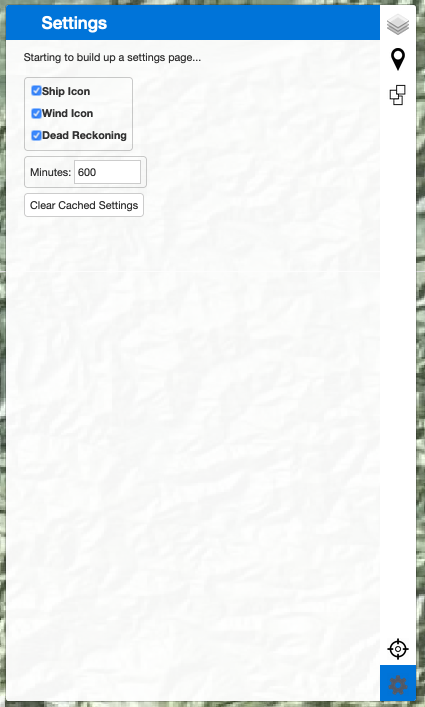

# Cruise Charts Page
The cruise charts page ("Cruise Charts" from the CORIOLIX navigation menu) is a web mapping interface for CORIOLIX.  It presents a dynamic map view of the vessel, its realtime data, and supporting geospatial information such as nearby research infrastructure, routes, and waypoints.  The cruise chart page also has built-in integrations with the Cruise Event Log and Route Planning tools.
## Basic Map controls:
Basic map controls include the "out-of-the-box" and ubiquitous *Zoom*, *Pan*, and *Mouse Coordinates* leaflet controls for navigation.
#### Zoom
Located in the upper lefthand corner of the map pane.  Click + to zoom in, click - to zoom out.  

#### Pan
Left click, hold and drag on the map to pan (note: no graphic of this operation).
#### Mouse Coordinates
Located in the lower righthand corner of the map pane.  Provides coordinate readout (decimal degrees) for mouse pointer location.  

## Menu Bar controls:
Menu Bar controls are custom controls to the CORIOLIX charting interface.  You may expand any of the controls by selecting its icon from the thin Menu Bar ribbon along the righthand side of the map pane.
#### Layer Control
Located in at the top of the Menu Bar, the Layer Control provides a interface for toggling layer visibility on the map.  

Two background layers are provided, NOAA Raster Nautical Charts (NOAA RNCs) and the Global Multi-Resolution Topography Synthesis (https://www.gmrt.org/)

The Ship Route Data grouping includes cruise track overlays for resident sensors and instrumentation.

The Raster Overlays is a demonstration of using ERDDAP to support a science mission with CORIOLIX.  In this demonstration case we have created a subscription for 8-day satellite SST and Chl composite imagery using our ERDDAP service onship and onshore.  The ERDDAP server manages the once daily data update and serves the imagery to the map viewer.

We also include overlays served from off-ship locations (clicking these will generate offship data requests), including:
- NOAA OCS Wrecks & Obstructions Database
- Weather Overlays from NOAA NowCOAST  

#### Custom Routing
Located just below the Layer Control in the Menu Bar, the Custom Routing controls provide a user interface for creating new routes (routes are defined here as simple line or polyline shapes stored as geoJSON in the CORIOLIX database).  Users may draw a route on the map, calculate route distance, and also the time required to complete route under various transit speeds.

#### Events
All cruise events are available for visualization in the charting interface.  The Events control, immediately below the Custom Routing control, provides the user a mechanism to toggle event visibility.  Place a check next to any event that you would like to make visible in the map view.

#### Re-Center Map
Click the "crosshairs" icon at the bottom of the menu bar to reposition the map view to have the vessel in the center of the view.  

#### Settings
We've made the display of the ship, the true winds wind barbs, and the dead reckoning overlays optional for users.  You may use the setting page to toggle overlay icon visibility for these items as well as set a default cruise track display interval (default = 600 minutes or 10 hours).  We store this information in your browser cache (local storage) so that your preference persist between site visits.

