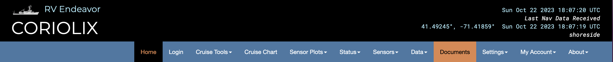

# Documents Page
This page has a list of all documents associated with your ship. This is everything including calibration files, images, sensor manuals, and other vendor supplied information that you have uploaded to CORIOLIX. The page loads with the documents sorted alphabetically by title but you can choose to sort them differently by toggling the arrows at the top of each category in the table. Documents linked to a specific sensor, such as a manual or calibration file, can also be found on the appropriate Sensor Info pages. 

The Search function is also very powerful and can help you find things quickly. Search terms can include (but are not limited to) partial serial numbers, sensor models, file type. 
