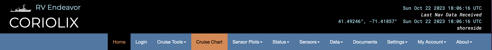
# Map Page
The map page ("Map" from the CORIOLIX navigation menu) is a web map interface for CORIOLIX.  It presents a dynamic map view of the vessel, its realtime data, and supporting geospatial information such as nearby research infrastructure, routes, and waypoints.  The map page also has built-in integrations with the Cruise Event Log and Route Planning tools.
## Basic Map controls:
Basic map controls include the "out-of-the-box" and familiar *Zoom*, *Pan*, and *Mouse Coordinates* controls.
#### Zoom
Located in the upper left-hand corner of the map pane.  Click + to zoom in, click - to zoom out.  
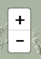
#### Pan
Left click, hold and drag on the map to pan (note: no graphic of this operation).
#### Mouse Coordinates
Located in the lower right-hand corner of the map pane.  Provides coordinate readout (in decimal degrees) for mouse pointer location.  
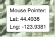

## Sidebar controls:
Sidebar controls are custom controls to the CORIOLIX charting interface.  You may expand any of the controls by selecting its icon from the thin sidebar ribbon along the right-hand side of the map pane.
#### Layer Control
Located in at the top of the sidebar, the Layer Control provides a interface for toggling layer visibility on the map.
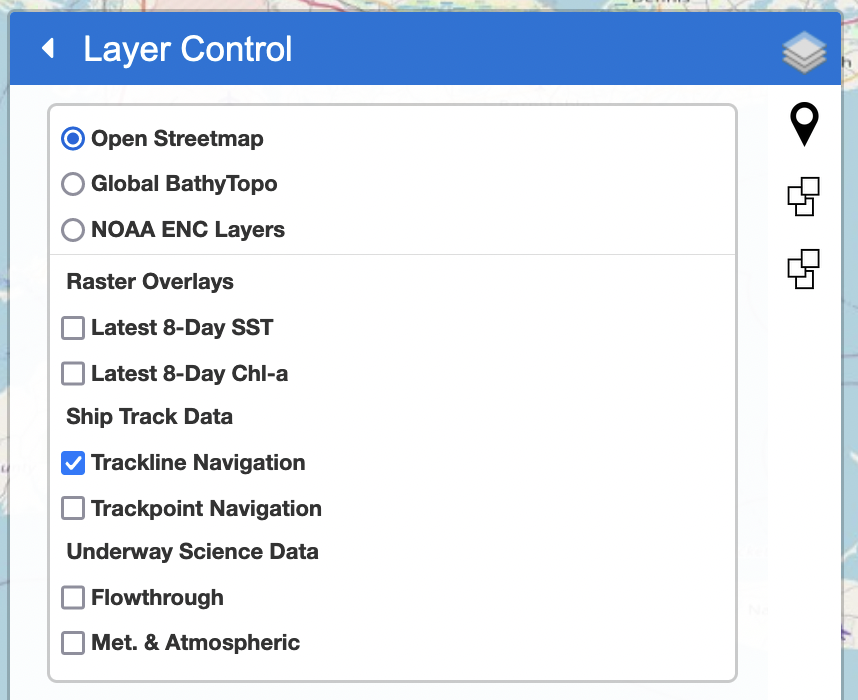

##### Background Layers:
Background layers (the top three layers) are externally sourced, locally cached, map services that provide geographic 'background' context to the charting interface.  One and only one background layer is always active, but we've selected three background layers to choose from.  You may add additional layers by request or by editing the map configuration file.

* Open Streetmap
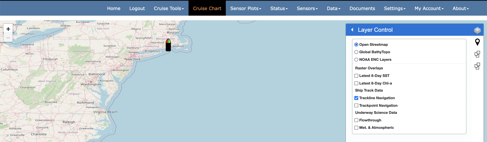

* Global Multi-Resolution Topography Synthesis (https://www.gmrt.org/)
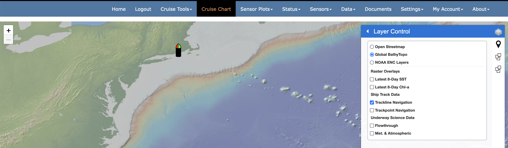

* NOAA Electronic Nautical Charts (NOAA ENCs)
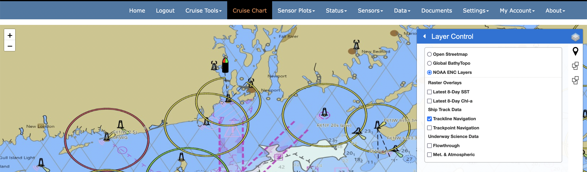

##### Raster Overlays
Raster overlays are similar to background layers.  They are also externally sourced, locally cached, map services that provide local context to the charting interface.  However, raster layers are off (inactive) by default.  When activated (selected) they plot on top of the background layers.  We've provided two default raster layers.  Currently the latest image is provided by default and there is no user control for vieweing past (out of date) imagery.

* 8-Day Composite Global SST 
* 8-Day Composite Global Chl-a conentration

##### Ship Track Data
This grouping presents the ship navigation in trackpoint (navigation fixes) or trackline (navigation path) format.  Note that trackpoints are clickable and will open a pop-up with Heading, COG, and SOG data relevant to the trackpoint of interest.

##### Underway Science Data
This grouping includes trackpoint overlays organized into two instrument class groups, Flowthrough and Met. & Atmospheric.  All points are clickable - to show relevant sensor data observations at that point, and may be colorized by unique instrument parameter via the settings tools.

#### Custom Routing
Located just below the Layer Control in the sidebar, the Custom Routing controls provide a user interface for creating new routes (routes are defined here as simple line or polyline shapes stored as geoJSON in the CORIOLIX database).  
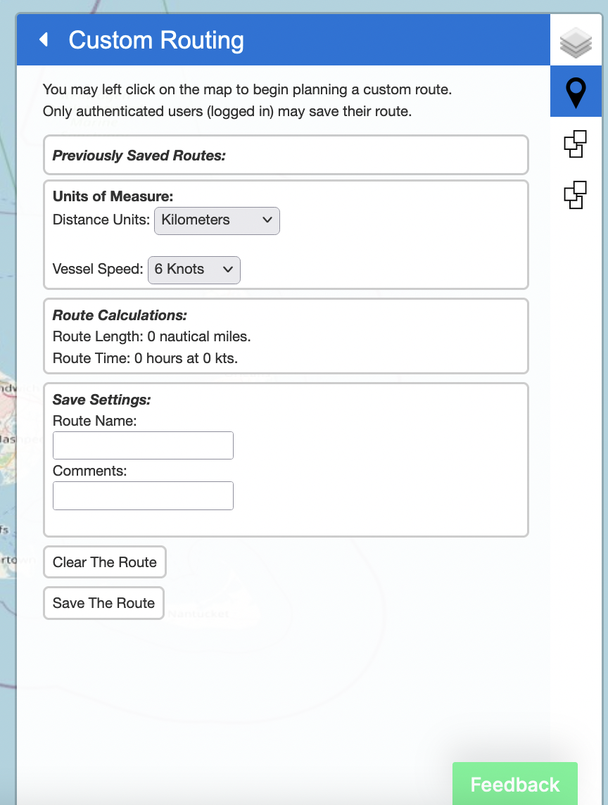
Users may draw a route on the map, calculate route distance, and also the time required to complete route under various transit speeds.
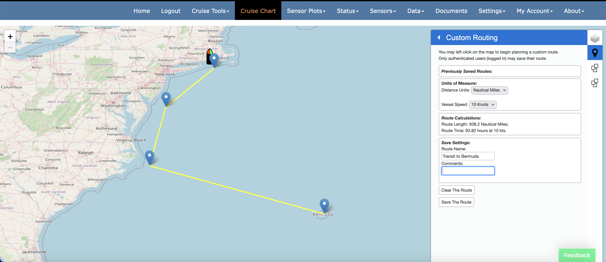

#### Events
All cruise events are available for visualization in the charting interface.  The Events control, immediately below the Custom Routing control, provides the user a mechanism to toggle event visibility.  Place a check next to any event that you would like to make visible in the map view.
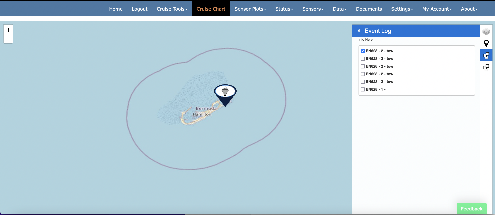

#### Re-Center Map
Click the "crosshairs" icon at the bottom of the sidebar to reposition the map view to have the vessel in the center of the view.  
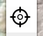

#### Settings
Use the map settings sidebar to modify the default behavior or setup of the map.  Chart settings will be saved to your browser cache and will persist across sessions.  Your settings will only be lost if/when you clear your cache.

The map settings sidebar is organized into 4 sections and the application makes informed choices on default settings given your current CORIOLIX configuration.

* Navigation Settings
* Flowthrough Settings
* Met. & Atmospheric Settings
* Vessel Settings

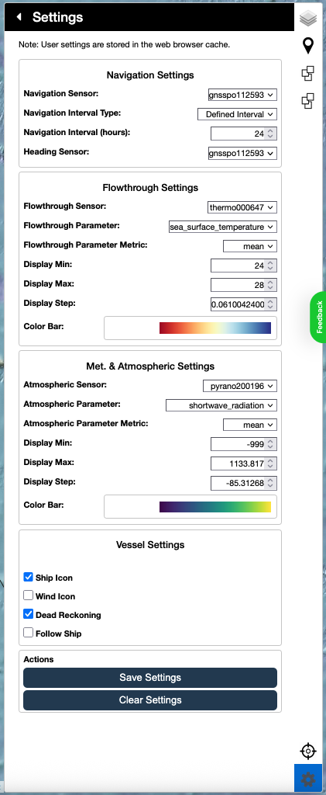

In the Navigation Settings section, you may select a navigation (position) and heading source for the map display.  By default we select for the primary navigation systems.  Navigation Interval sets the length of the shiptrack and underway data overlays.

The next two groups of settings (Flowthrough Settings and Met. & Atmospheric Settings) control how the Underway Science Data trackpoints will be rendered.  Use the dropdown menus to select an instrument and parameter of interest.  The application will auto-derive a display range and auto-select a color scheme.  You may override any selection.  

The Vessel Settings section includes a few global display options for the map page.  You may enable (check) or disable (uncheck) dispaly of the ship icon, true winds wind barbs, and a dead reckoning overlay.  You may also enable or disable auto tracking of the ship (keeps the ship icon inside the bounds of the map display).

__Be sure to save your custom selections by clicking "Save Settings" and refresh the map page after any settings change!
Choose "Clear Settings" to revert back to application default values.__
