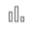
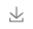

# Sensor Plots Pages

The sensor plots pages display specific groupings of real-time displays. The options in the dropdown menu take users to sensor plots pages with an integrated display of all sensors belonging to a system for quick and easy visual comparison. Links to direct data access are available on each plots page. Additionally, there are two types of customizable plots for users to create their own. Details on customizable plots are below.  

## Manipulating The Plots
Mousing over a plot will give you an information box that shows the timestamp, the parameter, and the measurement where the cursor is. 
Scrolling down on a plot will zoom out centered on where the cursor is. Scrolling up on a plot will zoom in centered on where the cursor is. 
The scroll bars on the axes also move the plots. The timestamps on either end of the X axis give the temporal range of the plot while the numbers on the Y axis give the range of the measurements of a given parameter. Clicking and dragging inside the box will zoom in to the selected section. Clicking and dragging the top of the bar will move the plot while keeping the length of time or measurement range the same. Users can also click and drag the sides of the bar to extend or shorten the ranges displayed on the plot.

There are icons to the right of each plot that change how it is displayed. Hover the cursor over the icons to learn what they do. They are also explained below. 

 Resets the plot so it is fully zoomed out on both axes. 

 Turns the plot into a scatter plot. 

 Turns the plot into a line plot.

 Turns the plot into a bar graph.

 Saves the plot as a .png image. 

All plot pages default to displaying the last 60 minutes of data and refreshing every 10 minutes. Both of these are user configurable but keep in mind: longer time intervals will take longer to load. Users can also refresh the plots at any time by clicking the page refresh button in the browser. 

## Combination
These plots are configurable in the Parameters list. They are meant to help users create specific plots relevant to their cruise. These plots will stay on the page as a dashboard for a user. 

## Customizable
This pages allows users to quickly create plots with any date range and up to four parameters of their choice. 
