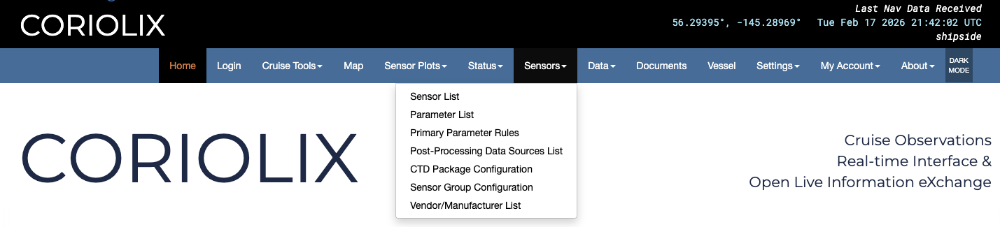

# Sensors Pages

## Sensor List
This page presents a tabular list of all scientific sensor equipment known to the system.  Gray shaded rows indicate that the sensor is currently disabled, white rows indicate that the sensor is currently enabled.  Rows may be sorted (forward or reverse) alphabetically by one of multiple fields using the arrow symbols that surround field names.  Anonymous users will see options to view metadata and realtime plots as well as acess the data.  Authenticated users with elevated permissions will be granted additional options including methods to modify or create new metadata.

## Parameter List
In a similar fashion to the Sensor List page, the Parameter List page presents a tabular list of all known parameters. The parameters table follows the same enabled/disabled display convention as the Sensor List table, and has the same sorting capability and restricted edit functionality.

## Primary Parameter Rules 
The table on this page allows users to clearly see which exact sensor is currently the primary or most reliable for each parameter. It's not tied to a serial number, rather a sensor model and its location on the ship. The sensors listed in this table are also the ones used for displaying data in the banner at the top of the page. 

## Post Processing Data Sources List
The purpose of this page a place to assign ancillary sensors and parameters for data processing. For example, if you are processing salinity data and you need it to reference GPS position, this table will clearly show which sensor you were using for each parameter. It allows the assigning of ancillary sensors based on location on ship so it is not tied to any one specific sensor. 

## CTD Package Configuration
This page allows you to build out and display your CTD package in CORIOLIX. This is NOT linked to SeaSave and you must still configure your CTD in SeaSave before deployment. You must configure your CTD package in each program separately. 

## Sensor Group Configuration
This page allows you to group sensors together in a convenient display. You can assign multiple "child" sensors to a "parent sensor" and display them all together. There are details at the top of the page for how to make sure data is ingested and parsed properly.

## Vendor/Manufacturer List
This page is a convenient display of vendor contact information for all the vendors of equipment on the ship as you have entered them into the system. You can sort them by toggling the arrows at the top of each column. 
