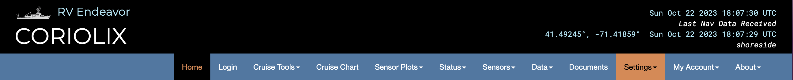

# Settings Page

The Settings section in CORIOLIX provides administrative controls for system configuration, data management, user accounts, and maintenance. The Settings menu contains four separate configuration areas, each managing different aspects of the CORIOLIX system.

## Settings Menu Structure

From the CORIOLIX navigation menu, click **Settings** to access a dropdown with four administrative configuration options:

1. **Flowthrough Configuration** - Manage valve operating parameters for flowthrough sampling systems
2. **Data Management** - Control data logging, retention policies, and real-time transmission settings
3. **Account Management** - Manage user accounts, permissions, and access levels
4. **System Management** - Refresh sytem configuration

**Note:** All Settings sections are restricted to support users only. Non-support users will see read-only views where available. The Account Management section is limited to administrators only.

---

## Flowthrough Configuration

The Flowthrough Configuration page manages automated valve switching systems used for controlled fluid sampling and filtering.

### Overview

Flowthrough systems use automated valves to switch between different fluid sources or filter configurations on a schedule. Each valve configuration defines:

- Which sensor/valve equipment is being controlled
- Open and closed durations (how long the valve stays in each position)
- What material is being sampled during each state (e.g., ambient seawater, filtered water, calibration fluid)
- Transition time required for the valve to switch positions

### Accessing Flowthrough Configuration

1. From the main navigation menu, click **Settings** → **Flowthrough Configuration**
2. The page displays a table of all configured valves
3. Depending on user permissions, Edit buttons may appear to manage configurations

### Viewing Valve Configurations

The table displays all active valve configurations with the following columns:

| Column | Description |
|--------|-------------|
| **Valve ID** | Unique identifier for the valve/sensor |
| **Open/Close Transition Time** | Time (in seconds) required for the valve to switch between open and closed states |
| **Open Content** | What material is being sampled when the valve is open (e.g., ambient seawater, filtered) |
| **Open Duration** | How long (in minutes) the valve remains open before closing |
| **Closed Content** | What material is being sampled/processed when the valve is closed (e.g., maintenance, calibration) |
| **Closed Duration** | How long (in minutes) the valve remains closed before opening |

### Managing Valve Configurations

#### Adding a New Valve Configuration

1. Click **Add New Valve Configuration** at the top of the page
2. Fill in the valve details:
   - Select the valve/sensor ID from the list
   - Enter transition time (seconds required to open/close)
   - Select open content type
   - Enter open duration (minutes)
   - Select closed content type
   - Enter closed duration (minutes)
3. Click **Save** to apply the configuration

#### Editing an Existing Valve Configuration

1. Click the **Edit** button next to the valve configuration
2. Modify the desired parameters
3. Click **Save** to update

#### Deleting a Valve Configuration

1. Click the **Delete** button next to the configuration (if available)
2. Confirm the deletion

### Best Practices

- **Timing**: Ensure total cycle time (open + closed + transition time) aligns with your sampling objectives
- **Content Labels**: Use clear, consistent naming for open/closed content types
- **Testing**: Test new configurations with the system in a safe state before deploying during data collection
- **Documentation**: Document the reason for configuration changes for audit purposes

---

## Data Management

The Data Management page in the Settings menu controls CORIOLIX data logging behavior, real-time transmission, and data retention policies.

### Overview

Data Management settings apply to CORIOLIX instances on both the ship and shore systems. They control:

- System-wide notifications and messages
- Real-time data transmission between ship and shore
- Data logging modes and privacy levels
- How long data is retained in different formats (raw files, backups, online database)

### Accessing Data Management

1. From the main navigation menu, click **Settings** → **Data Management**
2. The page shows current settings in a read-only view
3. Contact an Admin user if any settings need to be chamged. 

### General Settings

#### Message to Display

A system-wide message shown to all CORIOLIX users.

- **Field**: Text input (maximum 200 characters)
- **Use Case**: Display cruise-specific information, warnings, or scheduled maintenance notices
- **Example**: "Scheduled maintenance on Feb 15 - limited data access expected"

#### Message Severity

Indicates the importance level of the displayed message.

- **Range**: 1 (Low) to 3 (High)
- **Impact**: Higher severity messages may be highlighted more prominently in the interface
- **Recommended**: 1 for routine notices, 2-3 for urgent matters

### Data Logging Settings

#### Data Privacy Level

Controls the classification level for collected data and determines who can access it.

- **Field**: Dropdown selection
- **Options**: Vary by organization's data governance policies
- **Recommendation**: Set based on cruise requirements and institutional policies
- **Examples**: Public, Research (limited sharing), Private (ship only)

#### Send Real-time Data from Ship to Shore

Enables or disables the transmission of real-time observations from the ship to the shore station.

- **Field**: Boolean toggle (True/False)
- **Default**: True (enabled)
- **When to Disable**: Limited connectivity, expensive bandwidth, or testing scenarios
- **Impact**:
  - When **True** (enabled): Data transmits as collected; shore station receives real-time updates
  - When **False** (disabled): Data remains on ship until manual transfer

#### Logging Mode

Determines where CORIOLIX archives live measurement data and which storage destinations are used.

**Options**:

- **file**: Logs data to flat files only
- **db**: Logs data to database only
- **file/db**: Logs data to both flat files and database (recommended for full redundancy)
- Other options available depending on system configuration
- **Recommended**: file/db (provides backup in both file and database systems)
- **Alert Indicator**: Color highlighting if setting differs from recommended practice

#### EEZ Mode

Controls data handling when operating in Exclusive Economic Zone (territorial) waters.

- **Field**: Toggle (On/Off)
- **When to Enable**: When vessel is in territorial waters with special data access agreements
- **Impact**: Applies special handling according to EEZ regulations and data sharing agreements

#### Custom Bin Interval

Sets the time interval (in seconds) for binning/averaging raw sensor data into standard intervals.

- **Range**: 10 to 86,400 seconds
- **Examples**:
  - 10 seconds: High-resolution binning for detailed analysis
  - 60 seconds: Standard one-minute intervals (most common)
  - 300 seconds: Five-minute intervals for reduced data volume
  - 86,400 seconds: Daily averaging only
- **Use Case**: Adjust based on data resolution needs and storage constraints

### Data Storage Duration Settings

These settings control automatic data retention and deletion. Data older than the specified retention period is automatically archived or deleted.

#### Raw Flat Files (Local Archive)

Duration for retaining raw, unprocessed sensor data files on local storage.

- **Range**: 10 to 1,000 days
- **Recommended**: 180 days or longer
- **Disk Space**: Longer retention requires more local storage
- **Recovery**: Once deleted, raw data cannot be recovered
- **Use Case**: Balance between data availability and storage limitations

#### Emergency Backup Raw Files

Duration for maintaining a rolling backup of raw files on the server of first receipt.

- **Range**: 0 to 1,000 days
- **Recommended**: 30 to 45 days
- **Purpose**: Secondary backup in case of transmission or processing errors
- **Set to 0**: Disables backups (saves storage but reduces redundancy)
- **Critical Deployments**: Keep enabled for high-risk or long-duration cruises

#### Online Data (Database Contents)

Duration for retaining processed data in the CORIOLIX database accessible via web interface.

- **Range**: 30 to 1,000 days
- **Recommended**: 180 days
- **Special Value**: Set to 1,000 to keep all data indefinitely
- **Database Impact**: Longer retention increases database size; may affect query speed
- **Data Access**: Older data can still be accessed through raw file archives

### Making Changes to Data Management Settings

1. Click the **Edit** button (admin users only)
2. Modify desired fields:
   - Fill in text fields as needed
   - Select options from dropdown menus
   - Enter numeric values within specified ranges
   - Toggle on/off switches
3. Review your changes
4. Click **Submit** to save immediately to both ship and shore systems
5. Click **Cancel** to discard and return to read-only view

**Important**: Changes take effect immediately across all CORIOLIX instances.

### Data Management Best Practices

- **Retention Balance**: Keep sufficient raw file retention for re-processing but manage storage costs
- **Privacy Compliance**: Align privacy level with cruise requirements and institutional policies
- **Backup Strategy**: Enable emergency backups unless storage is severely constrained
- **Real-time Transmission**: Disable only when connectivity/bandwidth issues require it
- **Change Documentation**: Record reason and date of setting changes for audit trails
- **Testing**: Test modifications in a non-critical system first if possible

---

## Account Management

The Account Management page allows administrators to manage CORIOLIX user accounts, assign permission levels, and control data access privileges.

**Note:** This page is only accessible to CORIOLIX administrators.
**Note:** These settings apply to CORIOLIX instances on both the ship and shore.

### Accessing Account Management

1. From the main navigation menu, click **Settings** → **Account Management**
2. The page shows two tables: Active Accounts and Inactive Accounts
3. Account viewing and modifications require administrative privileges

### Active Accounts Table

Displays all currently active user accounts with sortable columns:

| Column | Description |
|--------|-------------|
| **First Name** | User's first name |
| **Last Name** | User's last name |
| **Email** | User's email address |
| **Affiliation** | Organization or institution |
| **Last Login** | Most recent login date |
| **Role** | User's assigned role |
| **Permission Level** | Access level to system features |
| **Designated Contact** | Whether user is designated data contact |
| **Data Access Level** | Access to private/sensitive data |
| **Allow Login** | Whether account is enabled for log-in |

### Managing User Accounts

#### Permission Levels

Four permission levels control feature access:

- **Public**: Limited access, suitable for data consumers
- **Science**: Full data access, research-oriented permissions
- **Support**: Technical support staff permissions
- **Administrator**: Full system access and management capabilities

#### Designated Contact

Check the **Designated Contact** checkbox to mark a user as the primary data contact. The contact information for these users are included with data delivered to long-term archives.

#### Data Access Level

Check the **Private Data Access** checkbox to grant a user access to:

- Confidential cruise data before public release

#### Allow Login

Check the **Allow Login** checkbox to enable an account for user sign-in. Uncheck to disable access without deleting the account.

#### Making Changes

1. Modify the desired account settings using radio buttons and checkboxes
2. Review your changes carefully
3. Click **Submit** to apply changes to both ship and shore systems
4. Click **Cancel** to discard changes
5. Account changes take effect immediately.

### Inactive Accounts Table

Displays user accounts that have been disabled (Allow Login unchecked). These can be reactivated by checking the Allow Login checkbox.

### Account Management Best Practices

- **Principle of Least Privilege**: Assign the minimum permission level needed for each user's role
- **Designated Contacts**: Maintain at least 2-3 designated data contacts
- **Regular Review**: Periodically review active accounts and remove departed team members
- **Access Control**: Use data access restrictions for sensitive pre-publication data
- **Documentation**: Record account modifications and the reason for changes
- **Permission Levels**: Use Science level for researchers, Support for IT staff, Admin only as needed
- **Shared Accounts**: Disallow the use of shared accounts (e.g. techs@myship.edu) to ensure accountability

---

## System Management

The System Management page provides access to CORIOLIX system refresh operations.

**Important Note:** System Management actions ONLY affect the local CORIOLIX instance (either ship OR shore, not both).

### Accessing System Management

1. From the main navigation menu, click **Settings** → **System Management**
2. Only user with support roles can view this section
3. A single action button is displayed: **Refresh CORIOLIX**

### Refresh CORIOLIX Operation

The Refresh operation updates all CORIOLIX configurations and deploys recent changes to the active system.

#### When to Use Refresh

A CORIOLIX refresh is recommended after any of the following:

- A sensor is added, edited, removed, enabled, or disabled
- A parameter is added, edited, or removed
- The database schema is modified (tables added, modified, or removed)
- Major configuration files are updated
- You want to sync changes from configuration tools like OpenRVDAS or ERDDAP

#### Starting a Refresh

1. Click the **Refresh CORIOLIX** button
2. The refresh process begins automatically and progresses through multiple steps
3. A progress indicator shows: "Step X of 9..."
4. **Typical duration**: 20 seconds
5. The page displays output for each step as it completes

#### Refresh Steps

The refresh operation performs these steps sequentially:

1. **Create/Modify Dynamic Data Tables** - Updates database table structures based on current configuration
2. **Update OpenRVDAS Configurations** - Regenerates YAML files for the data acquisition system
3. **Update Sensor Alert Configurations** - Applies current alert rules to sensors
4. **Update ERDDAP Datasets** - Refreshes data exposure to external data discovery services
5. **Update pgAgent Jobs** - Schedules automated tasks (rolling tables, alerts, maintenance)
6. **Update Table Triggers** - Implements database triggers for real-time processing
7. **Update Primary Parameter Configurations** - Updates which parameters should be designated as primary
8. **Implement New OpenRVDAS Configurations** - Deploys updated acquisition configurations
9. **Update and Restart ERDDAP** - Restarts external data discovery services

#### Monitoring the Refresh

- Watch the step counter as the refresh progresses
- Monitor the output panel for error messages or warnings
- Once Step 9 completes, the refresh is finished
- The button returns to **Refresh CORIOLIX**, indicating readiness for another refresh if needed

#### Disabling Refresh for Non-Support Users

The button shows as **Refresh CORIOLIX (disabled)** for users without adequate permissions.

### System Management Best Practices

- **Schedule Refreshes Strategically**: Perform refreshes during low-traffic periods to minimize user impact
- **Inform Users**: Inform active users of potential downtime
- **Back Up Configuration**: Keep backup copies of critical configuration files before major changes
- **Test Changes**: Test sensor or parameter changes in a non-critical system before deploying to production
- **Document Changes**: Record what configuration changes triggered the refresh
- **Monitor Output**: Review the refresh output for warnings even if it completes successfully
- **Plan for Downtime**: Some ERDDAP operations may briefly affect data service availability

---

## Related Documentation

- [Admin Getting Started](admin_getting_started.md) - Administrative user overview
- [Data Access](HT_data_access.md) - Accessing and downloading CORIOLIX data
- [Logs & Monitoring](LOGS_coriolix.md) - System logs and health monitoring
- [API Endpoints](API_endpoints.md) - Integration and external data access
