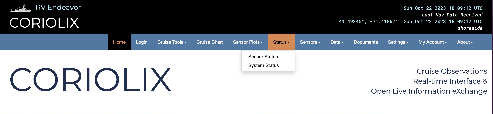
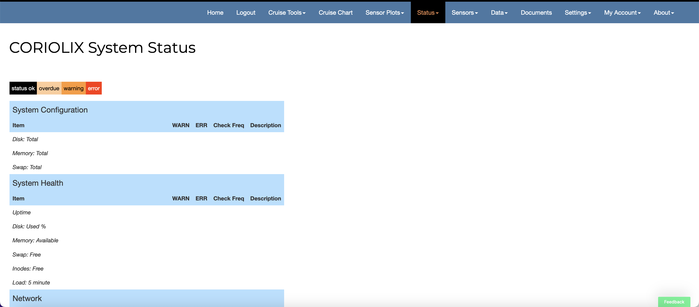

# Sensor/Parameter Status Page
This page provides a quick table style view of every enabled data parameter in the CORIOLIX system. Parameters are organized alphabetically as cells and grouped by sensor class (Flowthrough, Navigation, Atmospheric, etc.). Each cell in the status table provides basic information on that specific sensor or parameter. Clicking on a cell will take users to the associated data page. 

The status of a sensor or parameter is indicated by the color of the cell. Black cells mean that sensor or parameter is functioning properly. Cell color other than black indicates that the parameter is experiencing an abnormal condition and a warning has been issued.  

These status indicators are automatically generated but there are other types of alerts that are configurable by user. Instructions on how to configure alerts can be found in the [Setting Up User Specific Alerts](https://r-desc.github.io/CORIOLIX_docs/HT_account/#setting-up-your-user-specific-alerts) section on the Accounts page. 

## System Status
The system status page reports the health of the CORIOLIX deployment. Because CORIOLIX is part of a suite of monitored equipment, the System Status page pulls system hardware health from the external monitoring system rather than duplicate that monitoring locally.

