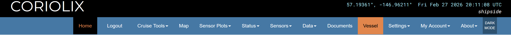

# Vessel Page

The **Vessel** page provides detailed information about the ship or platform.  
It includes vessel identifiers, dimensions, operating institute, and geodetic reference points.

The Vessel page contains sections for:

- **Vessel Name & Type** – General identification information  
- **Vessel Codes** – Standard international vessel identifiers  
- **Dimensions** – Physical characteristics of the vessel  
- **Operating Institute** – Ownership and home port information  
- **Monuments, Benchmarks, and Survey Marks** – Reference markers for navigation and geospatial measurements  

---

## Vessel Name & Type

### Overview

This section lists the vessel’s official name(s) and type.

| Field | Description |
|-------|-------------|
| **Vessel Name** | Official vessel name |
| **Vessel Type** | Type of vessel (e.g., RV, commercial, research) |
| **Vessel Long Name** | Full long-form name (if different from official name) |
| **Vessel Short Name** | Short name or abbreviation used internally |

### Editing Vessel Name & Type

1. Click **Edit** next to the Vessel Name & Type section  
2. Modify the fields as needed  
3. Click **Save** to apply changes  

---

## Vessel Codes

### Overview

Standard codes uniquely identify the vessel internationally.

| Field | Description |
|-------|-------------|
| **Call Sign** | Radio call sign assigned to vessel |
| **IMO** | International Maritime Organization number |
| **MMSI** | Maritime Mobile Service Identity |
| **ICES** | International Council for the Exploration of the Sea vessel code |

### Editing Vessel Codes

1. Click **Edit** next to Vessel Codes  
2. Update the code fields as necessary  
3. Click **Save** to apply changes  

---

## Dimensions

### Overview

The Dimensions section describes the vessel’s physical characteristics.

| Field | Description |
|-------|-------------|
| **Length (m)** | Overall length of the vessel in meters |
| **Breadth (m)** | Width of the vessel in meters |
| **Freeboard (m)** | Height from waterline to main deck |
| **Draft (m)** | Depth of vessel below waterline |

### Editing Dimensions

1. Click **Edit** next to Dimensions  
2. Enter or update the numeric values  
3. Click **Save** to apply changes  

---

## Operating Institute

### Overview

This section provides ownership and operational information.

| Field | Description |
|-------|-------------|
| **Operating Institute** | Organization responsible for the vessel |
| **Operating Home Country** | Country where the vessel is registered/operated |
| **Home Port** | Primary port of operations |
| **Vessel Website** | URL for official vessel information |

### Editing Operating Institute Information

1. Click **Edit** next to Operating Institute  
2. Modify the fields as needed  
3. Click **Save** to apply changes  

---

## Monuments, Benchmarks, and Survey Marks

### Overview

Reference points are used for navigation, geospatial measurements, and scientific data alignment.

| Column | Explanation |
|--------|------------|
| **Marker Name** | The name or identifier for the reference point or marker. |
| **Marker Type** | The type of marker (e.g., benchmark, survey, monument, unmarked). |
| **X Origin / Y Origin / Z Origin** | Reference points used to define the marker’s location in 3D space. |
| **Offset From** | Indicates if this marker’s position is measured relative to another marker. |
| **X Offset Bow / Y Offset Starboard / Z Offset Down** | Distances from the reference origin in meters along the vessel axes. |
| **Description** | Additional notes about the marker, its purpose, or location. |

### Editing Markers

1. Click **Edit Markers** in the Monuments section  
2. Add, modify, or remove marker entries as necessary  
3. Click **Save** to apply changes  

### Best Practices

- Maintain accurate offsets and origins for geospatial alignment  
- Use descriptive marker names for clarity  
- Update marker positions if the vessel undergoes modifications or renovations  
- Document changes for auditing and reference  

---

Most users only need to **view this information**, while edits are generally restricted to vessel administrators or support staff.
